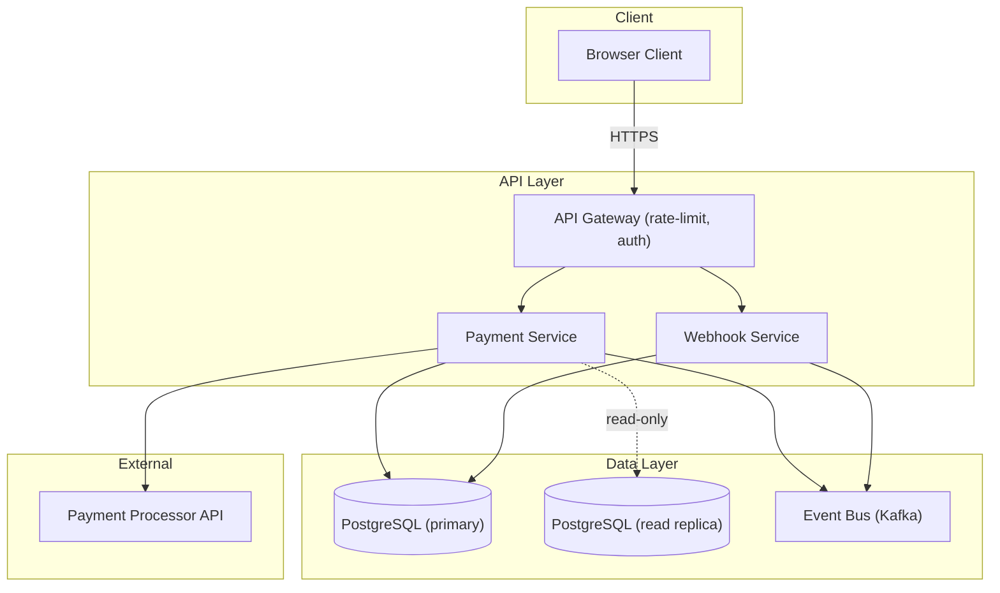

# Aegis Formalism Level: Formal

> Part of the Aegis Framework — `aegis/framework/levels/formal.md`
> See `SPEC.md §3` for the full level comparison table.

---

## When to Use

Choose **Formal** when:

- The project is in a **regulated industry**: fintech, healthcare, insurance, legal, government, or any domain with compliance obligations (SOC 2, PCI-DSS, LGPD, HIPAA, ISO 27001, GDPR).
- The total functional requirement count is **50 or more**.
- The architecture involves **multiple teams**, multiple services, or cross-organizational integrations.
- The cost of a design defect is high: financial loss, regulatory penalty, patient safety risk, or legal liability.
- Auditability is required: an external auditor, regulator, or security assessor must be able to trace any behavior back to a documented requirement and a verification record.
- The project is **critical infrastructure**: payment processing, authentication providers, data pipelines with PII, or systems with no acceptable downtime.

Do not use Formal when speed of iteration is the primary goal and no regulatory or safety constraints apply — use Standard instead.

---

## Requirements Format

### Structure

- **Mandatory glossary**: every domain-specific term, system entity, actor, and protocol referenced in the requirements must be defined in a Glossary section that precedes all requirement definitions.
- **SHALL / WHEN / IF vocabulary**: all behavioral statements use formal modal verbs.
  - `SHALL` — mandatory behavior, no exceptions.
  - `SHALL NOT` — explicitly prohibited behavior.
  - `WHEN [condition]` — precondition that activates a behavior.
  - `IF [condition], THEN [consequence]` — conditional outcome.
  - Plain language is used only for context paragraphs, never for normative criteria.
- **Numbered criteria**: each acceptance criterion is numbered within its requirement block. Cross-references between requirements use the full `REQ-NNN.N` notation (e.g., REQ-007.3 refers to criterion 3 of REQ-007).
- **Origin tracing**: each requirement block includes a `Source:` field citing the input document and section that motivated the requirement. This enables backward traceability from requirement to business intent.
- **Priority and risk fields**: each requirement includes `Priority: [Critical | High | Medium | Low]` and `Risk: [High | Medium | Low]`, used by the design and tasks agents to allocate depth of coverage.
- Security requirements (SEC-REQ-*) are always present — see Security section below.

### Example

```markdown
## Glossary

| Term                  | Definition                                                                                           |
|-----------------------|------------------------------------------------------------------------------------------------------|
| Payment Intent        | A server-side record representing a user's intent to complete a specific transaction.               |
| Idempotency Key       | A client-supplied unique token that allows a request to be submitted multiple times safely.          |
| Settlement            | The process by which captured funds are transferred from the customer's bank to the merchant.        |
| Chargeback            | A reversal of a completed transaction initiated by the cardholder's bank.                            |
| PCI-DSS Scope         | The set of systems that store, process, or transmit cardholder data as defined by PCI-DSS v4.0.     |
| Capture               | The act of finalizing an authorized transaction to collect funds.                                    |

---

## Requirements

### REQ-014: Payment Capture

**Source**: Product Specification §4.2 (Payment Lifecycle), PCI-DSS v4.0 Requirement 6.4
**Priority**: Critical
**Risk**: High

**Context**: A Payment Intent is created during checkout. Authorization is obtained
from the payment processor at cart submission. Capture must occur within 7 days of
authorization or the authorization expires.

**Acceptance Criteria**:

1. The system SHALL expose a server-side capture endpoint that accepts a
   `paymentIntentId` and an optional `idempotencyKey`.
2. WHEN a capture request is received, the system SHALL verify that the Payment
   Intent is in `authorized` status before contacting the payment processor.
3. IF the Payment Intent is not in `authorized` status, the system SHALL return
   HTTP 422 with a machine-readable error code of `INVALID_STATE` and SHALL NOT
   contact the payment processor.
4. The system SHALL pass the `idempotencyKey` to the payment processor on every
   capture request. IF no `idempotencyKey` is supplied by the caller, the system
   SHALL generate one derived from `paymentIntentId` to guarantee at-most-once
   semantics.
5. WHEN the payment processor confirms capture, the system SHALL atomically update
   the Payment Intent status to `captured` and record `captured_at` timestamp.
6. WHEN the payment processor returns a transient error (HTTP 5xx or timeout), the
   system SHALL retry up to 3 times with exponential backoff before marking the
   Payment Intent as `capture_failed`.
7. The system SHALL emit a `payment.captured` event to the event bus within 500 ms
   of a successful capture for downstream reconciliation consumers.
8. All capture requests and responses SHALL be logged with full request/response
   bodies (excluding PAN and CVV) to the audit log with a correlation ID.

### REQ-015: Chargeback Notification Handling

**Source**: Product Specification §4.6 (Disputes), PCI-DSS v4.0 Requirement 12.10
**Priority**: High
**Risk**: High

**Context**: The payment processor sends webhook notifications when a chargeback
is initiated. The system must record the dispute and freeze the associated funds.

**Acceptance Criteria**:

1. The system SHALL expose a webhook endpoint that accepts chargeback notifications
   from the payment processor in the format defined by the processor's API contract.
2. WHEN a chargeback notification is received, the system SHALL verify the webhook
   signature before processing any payload content.
3. IF the signature is invalid, the system SHALL return HTTP 401 and SHALL log
   the attempt including the source IP and raw payload.
4. WHEN a valid chargeback notification is received, the system SHALL atomically
   create a Dispute record and set the associated Payment Intent status to
   `disputed` within a single database transaction.
5. The system SHALL NOT release any funds associated with a disputed Payment Intent
   until the Dispute is resolved with status `won` or `accepted`.
```

---

## Design Format

### Structure

- **Mermaid diagrams**: every major flow and every non-trivial component interaction must be documented with a Mermaid diagram. Required diagrams include: system architecture, authentication flow, data flow for each critical operation, deployment topology.
- **Full interfaces in the project language**: public interfaces are defined as actual code signatures (TypeScript interfaces, Go function signatures, Python Protocol classes, etc.) — not prose descriptions or simplified tables.
- **Complete data models**: full entity definitions with field names, types, constraints, indexes, and foreign key relationships. For SQL systems, include the CREATE TABLE equivalent. For NoSQL, include the document schema with required/optional annotations.
- **Exhaustive properties**: PROP-NNN entries cover all behavioral guarantees — functional, performance, consistency, and fault tolerance. There is no upper limit on property count. Every requirement (REQ-NNN) must be covered by at least one property.
- **Error handling**: each PROP-NNN that describes a fallible operation must include an explicit error-handling clause describing the system's behavior for every named error condition.
- Security properties (SEC-PROP-*) are always present — see Security section below.

### Example

```markdown
## Architecture



## Interfaces

```typescript
// Payment Service — TypeScript interface definitions

interface CapturePaymentRequest {
  paymentIntentId: string;    // UUID
  idempotencyKey?: string;    // max 64 chars; auto-generated if absent
}

interface CapturePaymentResponse {
  paymentIntentId: string;
  status: "captured" | "capture_failed";
  capturedAt: string;         // ISO 8601
  processorTransactionId: string;
}

interface CapturePaymentError {
  code: "INVALID_STATE" | "PROCESSOR_ERROR" | "TIMEOUT" | "NOT_FOUND";
  message: string;
  retryable: boolean;
  correlationId: string;
}

interface PaymentService {
  capturePayment(req: CapturePaymentRequest): Promise<CapturePaymentResponse>;
  getPaymentIntent(id: string): Promise<PaymentIntent>;
}
```

## Data Models

```sql
-- Payment Intents
CREATE TABLE payment_intents (
  id                    UUID PRIMARY KEY DEFAULT gen_random_uuid(),
  user_id               UUID NOT NULL REFERENCES users(id),
  amount_cents          INTEGER NOT NULL CHECK (amount_cents > 0),
  currency              CHAR(3) NOT NULL,
  status                TEXT NOT NULL CHECK (status IN (
                          'created','authorized','captured',
                          'capture_failed','refunded','disputed')),
  processor_intent_id   TEXT UNIQUE,
  idempotency_key       TEXT UNIQUE,
  authorized_at         TIMESTAMPTZ,
  captured_at           TIMESTAMPTZ,
  created_at            TIMESTAMPTZ NOT NULL DEFAULT now(),
  updated_at            TIMESTAMPTZ NOT NULL DEFAULT now()
);

CREATE INDEX idx_payment_intents_user_id ON payment_intents(user_id);
CREATE INDEX idx_payment_intents_status  ON payment_intents(status);

-- Disputes
CREATE TABLE disputes (
  id                  UUID PRIMARY KEY DEFAULT gen_random_uuid(),
  payment_intent_id   UUID NOT NULL REFERENCES payment_intents(id),
  processor_dispute_id TEXT UNIQUE NOT NULL,
  reason              TEXT NOT NULL,
  status              TEXT NOT NULL CHECK (status IN ('open','won','lost','accepted')),
  evidence_due_at     TIMESTAMPTZ,
  created_at          TIMESTAMPTZ NOT NULL DEFAULT now()
);
```

## Correctness Properties

### Payment Capture Area

**PROP-022: Capture is At-Most-Once**
Derives from: REQ-014
Priority: Critical
Description: The Payment Service guarantees that a given Payment Intent is
captured at most once, even under concurrent requests or network retries.
This is enforced by passing a stable idempotency key to the payment processor
and by holding a database-level advisory lock on the paymentIntentId for the
duration of the capture operation.
Error handling:
  - IF lock cannot be acquired within 5 seconds: return CapturePaymentError
    with code=TIMEOUT, retryable=true.
  - IF processor returns a duplicate idempotency error: return the existing
    capture response as if the operation succeeded (transparent idempotency).

**PROP-023: Status Transition is Atomic**
Derives from: REQ-014
Priority: Critical
Description: The update of payment_intents.status from `authorized` to `captured`
and the insertion of the audit log entry occur within a single serializable
database transaction. Either both succeed or neither persists.
Error handling:
  - IF the transaction fails after processor confirmation: a reconciliation job
    running on a 1-minute interval detects the discrepancy and re-applies the
    status update from the processor's ledger.

**PROP-024: Event Emission is Guaranteed**
Derives from: REQ-014
Priority: High
Description: The `payment.captured` event is published to Kafka using transactional
outbox pattern. The outbox record is written in the same transaction as the status
update (PROP-023). A relay process reads undelivered outbox records and publishes
them, retrying on failure until success or a 24-hour TTL is reached.
Error handling:
  - IF Kafka is unavailable: the outbox record persists; the relay retries with
    exponential backoff. The payment capture is not rolled back.
```

---

## UI Design Format (Optional)

### Structure

- **Comprehensive design vision**: rationale, key principles, visual positioning (competitive analysis of visual approach), mood & atmosphere description.
- **Complete design token system**: all values specified as CSS custom properties with semantic naming. Direct use of raw values in implementation is prohibited — always reference the token. Includes responsive type scale adjustments per breakpoint.
- **Exhaustive component specifications** (UI-NNN): each entry includes visual description with pixel-precise values, ALL states including edge cases (truncation behavior, overflow, extreme content lengths), responsive behavior per breakpoint, animation choreography (trigger, property, from→to, duration, easing, delay), full accessibility compliance matrix mapping each component to WCAG success criteria, and a design QA checklist.
- **Detailed page specifications**: layout structure, visual hierarchy description, responsive layout per breakpoint, page load sequence (what loads first, skeleton strategy, stagger order), page-level interactions, performance targets.
- **Navigation & flow**: global navigation pattern with route transition map.
- **Accessibility compliance matrix**: WCAG criterion × UI-NNN mapping table.
- **Visual regression test specification**: what to capture, viewport, state, pixel tolerance.
- **Design QA checklist**: implementation verification checklist.

### Example

```markdown
## Design Vision

A precision-engineered fintech interface that communicates institutional trust
through restrained typography, a near-monochrome palette with a single teal
accent, and surgical use of whitespace. Every pixel serves a purpose.

### Design Principles
1. **Institutional precision** — Alignment to a 4px grid with zero tolerance.
2. **Data density without noise** — Tables and charts convey information without
   visual clutter; whitespace separates concerns.
3. **Progressive disclosure** — Primary data visible immediately; detail on demand.
4. **Accessible by default** — WCAG AAA on all critical financial data displays.

### Visual Positioning
Unlike consumer-facing fintech apps (Robinhood's playful gradients, Revolut's
dark-mode boldness), this interface targets institutional users who expect the
visual sobriety of Bloomberg Terminal married to the clarity of Stripe's
documentation. No decorative elements. No illustrations. Data speaks.

### Mood & Atmosphere
If this interface were a physical space, it would be a Swiss private bank lobby:
travertine floors, precisely spaced Mies chairs, a single fresh orchid. Nothing
extra, nothing missing.

## Design System

### Typography

**Design Tokens:**

| Token                    | Value                | CSS Custom Property         |
|--------------------------|----------------------|-----------------------------|
| --font-display           | Söhne Breit          | --font-display              |
| --font-body              | Söhne                | --font-body                 |
| --font-mono              | Söhne Mono           | --font-mono                 |
| --type-display-size      | 40px                 | --type-display-size         |
| --type-display-weight    | 600                  | --type-display-weight       |
| --type-display-lh        | 1.1                  | --type-display-lh           |
| --type-display-ls        | -0.03em              | --type-display-ls           |
| --type-body-size         | 15px                 | --type-body-size            |
| --type-body-weight       | 400                  | --type-body-weight          |
| --type-body-lh           | 1.6                  | --type-body-lh              |

**Responsive Type Scale Adjustments:**

| Level   | Mobile  | Tablet  | Desktop |
|---------|---------|---------|---------|
| Display | 28px    | 34px    | 40px    |
| H1      | 24px    | 28px    | 32px    |
| Body    | 14px    | 15px    | 15px    |

**Truncation Rules:**
- Single-line fields: ellipsis after container width minus 8px padding
- Multi-line: max 3 lines with -webkit-line-clamp, fade-out on last line
- Currency amounts: NEVER truncate — reduce font size to --type-body-sm if needed

### Component Specifications

### UI-014: Transaction Row
Derives from: REQ-014

**Visual Description:**
Full-width row, 56px height, 16px horizontal padding. Left: status indicator
(8px circle, color by status token). Center: merchant name in --font-body 15px/500,
timestamp in --font-mono 12px/400 var(--color-muted). Right: amount in --font-mono
15px/600, aligned right. Bottom: 1px solid var(--color-border-subtle).

**States:**

| State    | Visual Changes                                              |
|----------|-------------------------------------------------------------|
| Default  | As described                                                |
| Hover    | Background: var(--color-surface-hover); transition: 120ms ease |
| Active   | Background: var(--color-surface-active)                     |
| Focus    | 2px inset outline var(--color-focus), 0px offset            |
| Selected | Left border: 2px solid var(--color-primary); padding-left: 14px |
| Loading  | Skeleton: 3 rectangles (status circle + 2 text blocks), pulse animation 1.5s ease-in-out infinite |

**Edge Cases:**
- Merchant name > 40 chars: single-line truncation with ellipsis
- Negative amounts (refunds): prefix with "−" (U+2212), color: var(--color-success)
- Disputed: status circle = var(--color-warning), row opacity: 0.7
- Amount > 10 digits: reduce font to 13px, maintain right-alignment

**Accessibility Compliance:**

| WCAG Criterion | Requirement               | Implementation                              |
|----------------|---------------------------|---------------------------------------------|
| 1.3.1          | Info and relationships    | role="row", semantic cells with role="cell" |
| 1.4.3          | Contrast (minimum)        | Text: 7.2:1 on surface (exceeds AAA)       |
| 2.1.1          | Keyboard                  | Tab navigates rows, Enter opens detail      |
| 2.4.7          | Focus visible             | 2px inset outline, always visible           |
| 4.1.2          | Name, role, value         | aria-label: "{merchant} {amount} {date}"    |
```

---

## Tasks Format

### Structure

- **Subtasks**: every task includes subtasks using TASK-NNN.N notation. Subtasks represent distinct, assignable units of work. A task without subtasks signals a planning gap at Formal level.
- **Cross-references**: each task and subtask includes:
  - `Implements:` — PROP-NNN and/or REQ-NNN IDs
  - `Validates:` — TEST-* IDs for subtasks that implement test or verification logic
  - `Depends on:` — TASK-NNN IDs this task cannot begin without
- **Property-linked tests**: subtasks that write tests must reference the specific TEST-* ID they are implementing, creating a bidirectional link between the task plan and the test plan.
- **Checkpoints between blocks**: after each logical block of tasks (typically 3-7 tasks), a CHECKPOINT entry is required. The checkpoint defines what must be verified — manually or automatically — before the next block begins. Checkpoints may not be skipped.

### Example

```markdown
## Tasks

### Block 1: Payment Capture Core

**TASK-031: Capture Payment — Service Layer**
Implements: PROP-022, PROP-023, REQ-014
Estimate: 13h (PERT: O=10h, M=13h, P=20h)
Depends on: TASK-018 (database schema), TASK-022 (processor SDK setup)

  TASK-031.1: Implement advisory lock acquisition on paymentIntentId (2h)
    Implements: PROP-022
  TASK-031.2: Implement pre-capture state validation (status check) (1h)
    Implements: REQ-014.2, REQ-014.3
  TASK-031.3: Implement idempotency key derivation and processor call (3h)
    Implements: PROP-022, REQ-014.4
  TASK-031.4: Implement atomic DB transaction for status + audit log (3h)
    Implements: PROP-023
  TASK-031.5: Implement retry logic for transient processor errors (2h)
    Implements: REQ-014.6
  TASK-031.6: Write unit tests for state machine and error paths (2h)
    Implements: PROP-022, PROP-023
    Validates: TEST-PROP-022, TEST-PROP-023

**TASK-032: Capture Payment — Outbox and Event Emission**
Implements: PROP-024, REQ-014.7
Estimate: 8h (PERT: O=6h, M=8h, P=13h)
Depends on: TASK-031, TASK-020 (Kafka setup)

  TASK-032.1: Add outbox table to schema and migration (1h)
  TASK-032.2: Write outbox record inside capture transaction (2h)
    Implements: PROP-024
  TASK-032.3: Implement relay process with exponential backoff (3h)
    Implements: PROP-024
  TASK-032.4: Write integration tests for outbox relay (2h)
    Validates: TEST-PROP-024

---
**CHECKPOINT-01: Capture Core Complete**
Before proceeding to Block 2, verify:
- [ ] All TASK-031 and TASK-032 subtasks are merged and passing CI.
- [ ] TEST-PROP-022 and TEST-PROP-023 pass against a real PostgreSQL instance.
- [ ] No open TODO or FIXME comments in capture-related files.
- [ ] Outbox relay demonstrated via integration test with Kafka unavailable scenario.
---

### Block 2: Chargeback Webhook Handler

**TASK-033: Webhook Signature Verification**
Implements: REQ-015.2, REQ-015.3, SEC-PROP-WEBHOOKSIG
Estimate: 5h (PERT: O=3h, M=5h, P=8h)
Depends on: TASK-018

  TASK-033.1: Implement HMAC-SHA256 signature verification middleware (2h)
    Implements: SEC-PROP-WEBHOOKSIG
    Validates: TEST-SEC-WEBHOOKSIG
  TASK-033.2: Implement rejection logging with source IP and raw payload (1h)
    Implements: REQ-015.3
  TASK-033.3: Unit tests for valid, invalid, and missing signatures (2h)
    Validates: TEST-PROP-033
```

---

## Tests Format

### Structure

**Exhaustive coverage** is required at Formal level. The test plan must cover:

- **Property-based tests**: one or more tests per PROP-NNN, using generative testing (e.g., fast-check, Hypothesis, QuickCheck) for any property that describes behavior over a range of inputs.
- **End-to-end tests**: full user-journey tests for every REQ-NNN, covering the primary scenario, all named error conditions, and all conditional branches (WHEN / IF clauses in acceptance criteria).
- **Integration tests**: for every cross-service and cross-system interaction. Database state, event bus messages, and external API calls must all be asserted — not just HTTP response codes.
- **Contract tests**: for every external API dependency. Consumer-driven contract tests (e.g., Pact) must verify that the system's expectations of the processor API remain valid as the processor evolves.
- Security tests (TEST-SEC-*) are always present — see Security section below.

### Example

```markdown
## Tests

### Property Tests

**TEST-PROP-022: Capture at-most-once under concurrency**
Tests: PROP-022
Type: Property-based
Tool: fast-check
Property: For any valid paymentIntentId in `authorized` state, submitting N
concurrent capture requests results in exactly one `captured` record and exactly
one outbox event. The other N-1 requests receive either a success (idempotent)
or an error — never a second capture.
Parameters: N in [2, 10], tested over 100 runs.

**TEST-PROP-023: Status transition is atomic**
Tests: PROP-023
Type: Integration
Scenario: Inject a fault (rollback) after the processor call succeeds but before
the DB commit. Verify that payment_intents.status remains `authorized` and no
audit log entry was written. Verify the reconciliation job corrects the state
within 2 minutes.

**TEST-PROP-024: Outbox guarantees delivery under Kafka failure**
Tests: PROP-024
Type: Integration
Scenario: Disable Kafka during a capture operation. Verify capture returns
success, outbox record is written, and Kafka is not contacted. Re-enable Kafka.
Verify relay delivers the event within 5 retry cycles.

### End-to-End Tests

**TEST-REQ-014-HAPPY: Full capture lifecycle**
Tests: REQ-014 (all criteria)
Scenario: Create authorized PaymentIntent. Submit capture. Verify processor
called once, status=captured, audit log entry written, event emitted to Kafka.

**TEST-REQ-014-INVALID-STATE: Capture of non-authorized intent is rejected**
Tests: REQ-014.3
Scenario: Submit capture for a PaymentIntent in status=captured.
Expected: HTTP 422, code=INVALID_STATE, processor not contacted.

**TEST-REQ-014-RETRY: Transient processor error triggers retry**
Tests: REQ-014.6
Scenario: Stub processor to return HTTP 503 for first 2 calls, then 200.
Expected: System retries, third call succeeds, status=captured.

**TEST-REQ-015-SIG-INVALID: Invalid webhook signature is rejected**
Tests: REQ-015.2, REQ-015.3
Scenario: Send POST to chargeback webhook with tampered signature header.
Expected: HTTP 401, attempt logged with source IP and raw payload, no Dispute
record created, PaymentIntent status unchanged.

### Integration Tests

**TEST-PROP-023-DB: Transaction rollback leaves no partial state**
Tests: PROP-023
Scenario: Using pg fault injection, kill the connection after INSERT into audit
log but before COMMIT. Verify both the status update and audit log entry are
absent from the database.

### Contract Tests

**TEST-CONTRACT-PROCESSOR-CAPTURE: Capture API contract**
Tests: PROP-022
Type: Consumer contract (Pact)
Consumer expectations:
  - POST /v1/payment_intents/{id}/capture with Idempotency-Key header
  - Response on success: 200 with { id, status: "succeeded", captured_at }
  - Response on duplicate: 200 with same body (idempotent)
  - Response on not found: 404
Pact file: pacts/payment-service--processor.json
```

---

## Security

**Security treatment at the Formal level is FULL.**

This is identical in scope to Light and Standard — the formalism level does not add or remove security requirements. The framework core governs security unconditionally at all levels.

At Formal level, the following apply in addition to the baseline:

- **SEC-REQ-*** entries in `requirements.md` — generated from `security-requirements.yaml`. At minimum: IDOR, input validation, rate limiting, authentication, secrets management, plus any entries relevant to the project's compliance regime (PCI-DSS, HIPAA, LGPD, SOC 2).
- **SEC-PROP-*** entries in `design.md` — generated from `security-properties.yaml`, with full interface and data model coverage. Each SEC-PROP must include explicit error-handling behavior for the security control.
- **TEST-SEC-*** entries in `tests.md` — one per SEC-PROP-* entry, at integration or contract test level where applicable.
- **Compliance mapping section** in `tests.md` — a table mapping each SEC-REQ-* and SEC-PROP-* to the relevant compliance control (e.g., PCI-DSS Requirement 6.4, HIPAA §164.312). This section is required for all Formal-level projects.
- The **SECURITY_UNIVERSAL §14 checklist** referenced in `tests.md` as the minimum verification bar for each feature.

No configuration flag, command-line option, or user instruction can suppress or reduce security content.
