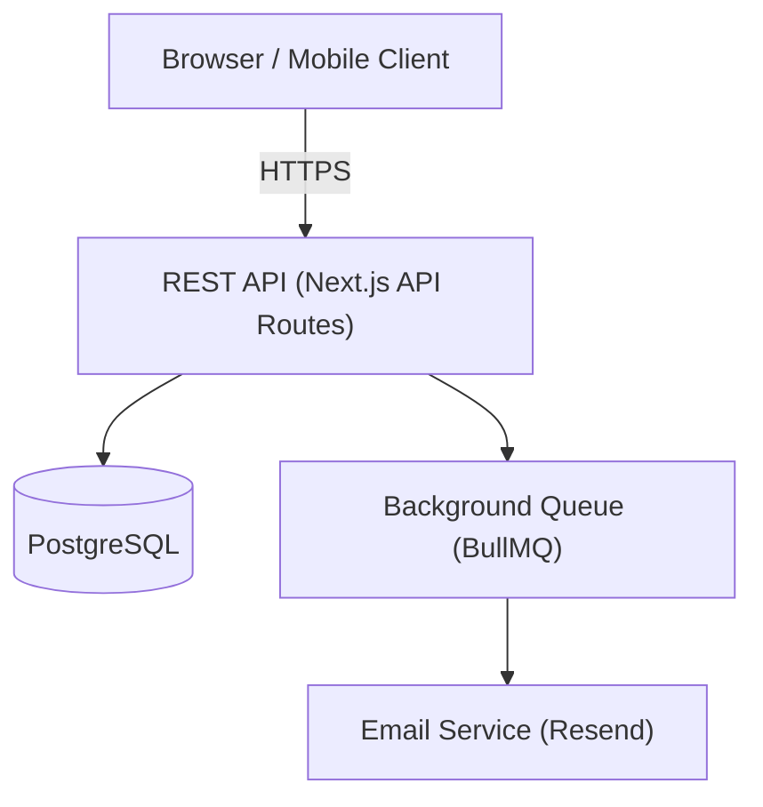

# Aegis Formalism Level: Standard

> Part of the Aegis Framework — `aegis/framework/levels/standard.md`
> See `SPEC.md §3` for the full level comparison table.

---

## When to Use

Choose **Standard** when:

- The project is a SaaS product, web or mobile app, REST API, GraphQL API, or any production system without formal regulatory constraints.
- The total functional requirement count is between **10 and 50**.
- A team of 2 or more people is working on the project.
- The project ships to real users and must be maintainable over time.
- Requirements need to be clear enough to hand off between team members without ambiguity.

Use **Formal** instead if the project is in a regulated industry (fintech, health, legal), handles PCI-DSS or HIPAA data, or has more than 50 requirements.

---

## Requirements Format

### Structure

- **User stories** per feature, written as: _As a [role], I want [capability] so that [benefit]_.
- **Numbered acceptance criteria** under each story. Criteria may use plain language at Standard level, but WHEN/SHALL/IF vocabulary is recommended for any criteria that describe conditional behavior.
- **Optional glossary**: include a Glossary section when the domain introduces more than 5 domain-specific terms. At Standard level this is recommended, not mandatory.
- Security requirements (SEC-REQ-*) are always present — see Security section below.

### Example

```markdown
## Glossary

| Term         | Definition                                                              |
|--------------|-------------------------------------------------------------------------|
| Workspace    | A top-level container owned by an organization, holding all projects.  |
| Member       | A user who belongs to a workspace with an assigned role.               |
| Invite       | A pending email-based invitation to join a workspace.                  |

---

## Requirements

### REQ-001: Workspace Invitation Flow

**User Story**: As a workspace admin, I want to invite new members by email so
that my team can access the workspace without requiring me to create accounts
for them manually.

**Acceptance Criteria**:
1. The admin can enter one or more email addresses and submit an invitation.
2. Each invited email receives a unique, single-use invitation link valid for 7 days.
3. WHEN a recipient clicks the link and does not have an account, the system
   SHALL prompt them to register before joining the workspace.
4. WHEN a recipient clicks the link and already has an account, the system
   SHALL add them to the workspace immediately and redirect to the workspace dashboard.
5. WHEN an invitation link has expired, the system SHALL display a clear error
   and offer the admin the option to resend.
6. An admin SHALL NOT be able to invite an email address that already belongs
   to a current workspace member.

### REQ-002: Role-Based Access Control

**User Story**: As a workspace admin, I want to assign roles to members so that
access to sensitive features is limited to authorized users.

**Acceptance Criteria**:
1. The system supports three roles: Owner, Admin, and Member.
2. Only Owners can delete the workspace or transfer ownership.
3. Admins can invite and remove Members but cannot remove other Admins or Owners.
4. Members have read-only access to workspace settings.
5. WHEN a member's role is changed, the change SHALL take effect within one
   request — no session restart required.
```

---

## Design Format

### Structure

- **Architecture diagram**: a Mermaid or ASCII diagram showing the major components, their responsibilities, and how they interact. Include at least one diagram for the overall system and one for each critical data flow (e.g., authentication, payment).
- **Components with interfaces**: for each major component, describe its public interface (inputs, outputs, key contracts). Full OpenAPI is optional at Standard level; describe endpoints in prose or a simplified table.
- **Full data models**: entity definitions with field names, types, and constraints. Relationships between entities must be explicit.
- **Properties per functional area**: define PROP-NNN entries grouped by functional area (e.g., Authentication, Data Access, Notifications). No fixed limit on count — cover all critical behavioral guarantees.
- Security properties (SEC-PROP-*) are always present — see Security section below.

### Example

```markdown
## Architecture



## Components

### Invitation Service

Responsible for creating, validating, and consuming workspace invitations.

| Operation          | Input                           | Output                        |
|--------------------|---------------------------------|-------------------------------|
| createInvite       | email, workspaceId, invitedById | invite record, queued email   |
| validateInviteToken| token                           | invite record or error        |
| consumeInvite      | token, acceptingUserId          | workspace membership record   |

### Role Enforcement Middleware

Applied to all API routes. Reads the session role for the authenticated user in
the target workspace and rejects requests that exceed the role's permission set.

## Data Models

```
Invite {
  id:          uuid        PK
  workspace_id: uuid       FK -> Workspace.id
  invited_by:  uuid        FK -> User.id
  email:       string      unique per workspace
  token:       string      unique, 64-byte random hex
  role:        enum        Owner | Admin | Member
  status:      enum        Pending | Accepted | Expired
  expires_at:  timestamp
  created_at:  timestamp
}

WorkspaceMember {
  id:           uuid       PK
  workspace_id: uuid       FK -> Workspace.id
  user_id:      uuid       FK -> User.id
  role:         enum       Owner | Admin | Member
  joined_at:    timestamp
}
```

## Correctness Properties

### Invitation Area

**PROP-005: Invitation Token is Single-Use**
Derives from: REQ-001
Description: Once an invitation token is consumed (status set to Accepted),
any subsequent request using the same token returns HTTP 410 Gone. The
consumeInvite operation is idempotent for the same user but rejects all
other users.

**PROP-006: Invitation Expiry is Server-Enforced**
Derives from: REQ-001
Description: Token validity is checked server-side against expires_at on every
validateInviteToken call. Client-side expiry display is informational only.

### Access Control Area

**PROP-007: Role Permissions are Request-Scoped**
Derives from: REQ-002
Description: The role enforcement middleware reads the current role from the
database on every request — it does not cache role data in the session token.
A role change takes effect on the next request by any client for that user.
```

---

## UI Design Format (Optional)

### Structure

- **Design vision**: 1-3 paragraphs with rationale, key principles (3-5), and the key differentiator.
- **Full design system**: typography scale (all levels with font family, size, weight, line-height, letter-spacing, color), color palette with CSS variables and contrast compliance table, spacing scale, grid system with breakpoints, border radius scale, motion tokens (duration and easing), shadow scale, and effects.
- **Component specifications** (UI-NNN): each entry includes visual description, states table (default, hover, active, focus, disabled), responsive behavior per breakpoint, animation/transition specs, and accessibility specs (ARIA, keyboard interaction).
- **Page layout specifications**: for every primary page/screen — grid placement, component assembly, responsive layout per breakpoint, page-level interactions.
- **Navigation & Flow**: global navigation pattern, mobile navigation, page transitions.

### Example

```markdown
## Design Vision

A refined, editorial-inspired interface built for readability and calm focus.
The design uses generous whitespace, a serif/grotesque font pairing, and a
muted earth-tone palette with a single sharp accent color for interactive elements.

### Design Principles
1. **Quiet confidence** — Let content breathe; never compete with it.
2. **Intentional contrast** — Reserve bold visual weight for actions and alerts.
3. **Responsive rhythm** — Spacing and typography adapt fluidly, not abruptly.

### Key Differentiator
A full-bleed editorial layout with oversized serif headings that break the grid,
creating a magazine-like reading experience uncommon in SaaS dashboards.

## Design System

### Typography

**Font Pairing Rationale**: Instrument Serif provides editorial gravitas for
headings while Satoshi (grotesque sans) ensures body text scannability. The
contrast in stroke modulation creates visual hierarchy without relying on size alone.

| Level   | Font Family      | Size | Weight | Line Height | Letter Spacing | Color   |
|---------|------------------|------|--------|-------------|----------------|---------|
| Display | Instrument Serif | 48px | 400    | 1.1         | -0.02em        | #1C1917 |
| H1      | Instrument Serif | 36px | 400    | 1.2         | -0.01em        | #1C1917 |
| H2      | Instrument Serif | 28px | 400    | 1.3         | 0              | #292524 |
| Body    | Satoshi          | 16px | 400    | 1.6         | 0              | #44403C |
| Caption | Satoshi          | 13px | 500    | 1.4         | 0.02em         | #78716C |

### Color Palette

| Token          | Value   | Usage                               |
|----------------|---------|-------------------------------------|
| --color-primary| #B45309 | Interactive elements, CTAs           |
| --color-bg     | #FAFAF9 | Page background                     |
| --color-surface| #FFFFFF | Cards, elevated elements             |
| --color-text   | #1C1917 | Headings                            |
| --color-body   | #44403C | Body text                           |
| --color-muted  | #A8A29E | Placeholder, disabled text           |
| --color-border | #E7E5E4 | Default borders                     |
| --color-error  | #DC2626 | Error states                        |

## Component Specifications

### UI-005: Workspace Card
Derives from: REQ-001

**Visual Description:**
280px-wide card, 24px padding, 1px solid var(--color-border), 6px border-radius,
var(--color-surface) background. Workspace name in H2 style. Member count in
Caption style below name. 40px bottom margin between cards.

**States:**

| State   | Visual Changes                                            |
|---------|-----------------------------------------------------------|
| Default | As described above                                        |
| Hover   | Shadow: 0 4px 12px rgba(0,0,0,0.06); transform: translateY(-1px); transition: 200ms ease-out |
| Focus   | 2px solid var(--color-primary) outline, 2px offset        |

**Responsive:**

| Breakpoint | Changes                                    |
|------------|--------------------------------------------|
| Mobile     | Full width, 16px padding, stacked vertically|
| Tablet     | 2-column grid, 20px gap                    |
| Desktop    | 3-column grid, 24px gap                    |

**Accessibility:**
- Role: article
- Keyboard: focusable via Tab, Enter activates navigation to workspace
```

---

## Tasks Format

### Structure

- **Tasks with subtasks**: top-level tasks use TASK-NNN IDs; subtasks use TASK-NNN.N (e.g., TASK-012.1, TASK-012.2).
- Each task includes:
  - `Implements:` — one or more PROP-NNN or REQ-NNN IDs
  - Effort estimate in hours or story points
  - `Depends on:` — other TASK-NNN IDs (omit if none)
- Subtasks do not require separate `Implements:` references if they inherit from the parent task.
- Security tasks (implementing SEC-PROP-*) follow the same format.

### Example

```markdown
## Tasks

### TASK-011: Invitation Service — Core Logic
Implements: PROP-005, PROP-006, REQ-001
Estimate: 8h
Depends on: TASK-003 (database schema setup)

  TASK-011.1: Create Invite model and migration
  TASK-011.2: Implement createInvite — generate token, set expiry, write record
  TASK-011.3: Implement validateInviteToken — check expiry and status
  TASK-011.4: Implement consumeInvite — atomic status update to Accepted
  TASK-011.5: Unit tests for all three operations

### TASK-012: Role Enforcement Middleware
Implements: PROP-007, REQ-002
Estimate: 5h
Depends on: TASK-005 (session setup)

  TASK-012.1: Define permission matrix (role -> allowed operations)
  TASK-012.2: Implement middleware — fetch live role, check permission, reject or pass
  TASK-012.3: Apply middleware to all workspace-scoped API routes
  TASK-012.4: Integration tests for each role boundary
```

---

## Tests Format

### Structure

- **End-to-end tests**: full user-journey tests for each REQ-NNN's primary scenario and at least one failure scenario.
- **Property-based tests**: one test per PROP-NNN, exercising the behavioral guarantee with varied inputs where applicable.
- **Integration tests**: for service-to-service and service-to-database interactions. Database state must be verified, not just API response codes.
- Security tests (TEST-SEC-*) are always present — see Security section below.

### Example

```markdown
## Tests

### End-to-End Tests

**TEST-REQ-001-HAPPY: New user accepts invitation**
Tests: REQ-001
Scenario: Admin invites new-user@example.com. New user receives email, clicks
link, registers account, and lands on workspace dashboard.
Expected: WorkspaceMember record created with role=Member. Invite status=Accepted.

**TEST-REQ-001-EXPIRED: Expired invitation is rejected**
Tests: REQ-001
Scenario: Time-travel expires_at to the past. User clicks link.
Expected: HTTP 410. Invite status remains Pending (not consumed). User is not
added to workspace.

### Property Tests

**TEST-PROP-005: Token is single-use**
Tests: PROP-005
Scenario: Valid token is consumed by User A. Same token is submitted again by
User A (idempotent) and then by User B (rejected).
Expected: Second call by User A returns the existing membership. Call by User B
returns HTTP 410.

**TEST-PROP-007: Role change takes effect immediately**
Tests: PROP-007
Scenario: User has role=Member. Admin upgrades role to Admin. User immediately
calls an Admin-only endpoint without refreshing session.
Expected: HTTP 200. No re-login required.

### Integration Tests

**TEST-PROP-006-DB: Server enforces expiry via database timestamp**
Tests: PROP-006
Scenario: Directly insert an Invite record with expires_at in the past. Call
validateInviteToken. Verify the service reads expires_at from DB and returns
an expiry error — without any client-supplied timestamp.
```

---

## Security

**Security treatment at the Standard level is FULL — identical to Light and Formal.**

This is unconditional. The formalism level setting exclusively controls the depth of functional, design, and test content. Security is governed by the framework core and is not reduced or made optional at any level.

Specifically, every Standard-level project must include:

- **SEC-REQ-*** entries in `requirements.md` — generated by the requirements agent from `security-requirements.yaml`. At minimum: IDOR, input validation, rate limiting, authentication, secrets management.
- **SEC-PROP-*** entries in `design.md` — generated by the design agent from `security-properties.yaml`, each deriving from one or more SEC-REQ-* entries.
- **TEST-SEC-*** entries in `tests.md` — generated by the tests agent, one per SEC-PROP-* entry.
- The **SECURITY_UNIVERSAL §14 checklist** referenced in `tests.md` as the minimum verification bar for each feature.

No configuration flag, command-line option, or user instruction can suppress or reduce security content.
