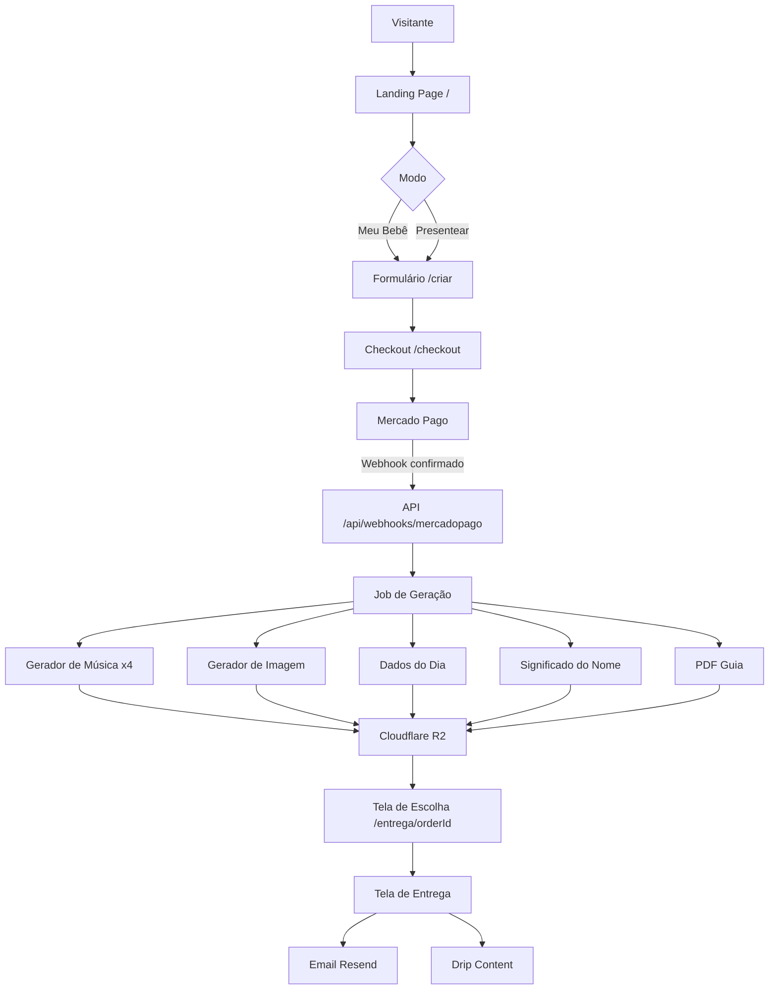
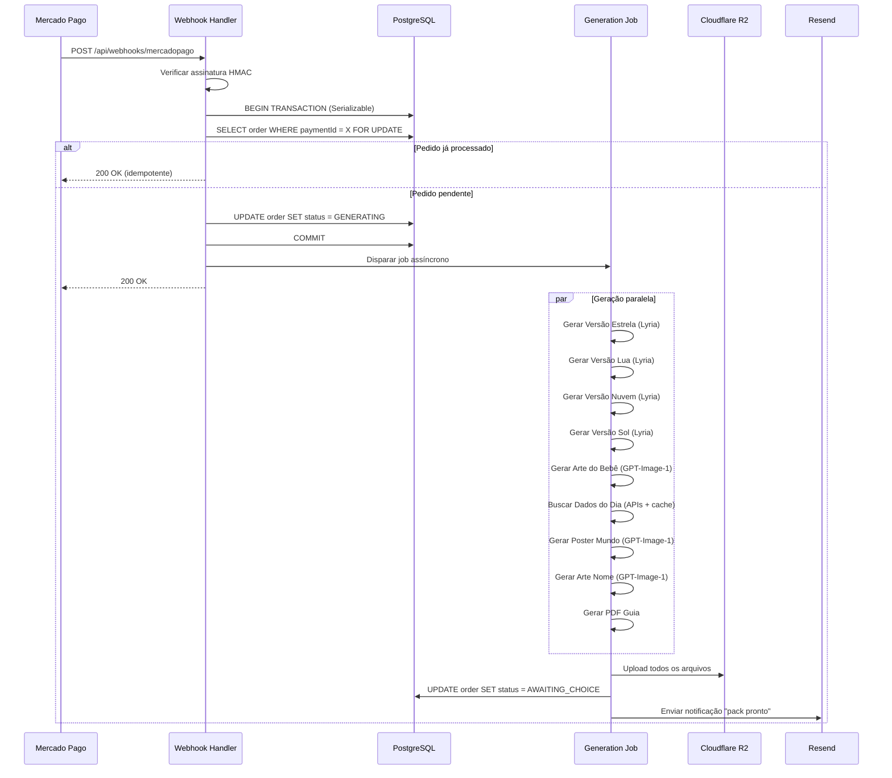

# Design Técnico — NossoBebê Platform

## Overview

O NossoBebê é um micro-SaaS de pack comemorativo digital para recém-nascidos. O sistema recebe dados do bebê e preferências dos pais, processa pagamento via Mercado Pago, gera em paralelo 4 canções de ninar completas (Google Lyria 3 Pro / Suno fallback) + arte personalizada (GPT-Image-1) + poster de dados do dia + arte do significado do nome + PDF do guia, e entrega tudo via tela de download + email.

O fluxo central é: **Landing Page → Modo (Meu Bebê / Presentear) → Formulário → Checkout → Geração Paralela → Tela de Escolha de Canção → Entrega**. O sistema também inclui blog SEO programático e drip content por email.

Stack: Next.js 14+ App Router (TypeScript strict), Prisma + PostgreSQL (Railway), Cloudflare R2, Mercado Pago, Resend, PostHog, @upstash/ratelimit, Vercel.

---

## Architecture

### Visão Geral



### Camadas da Aplicação

```
app/                          ← Next.js App Router
├── (marketing)/              ← Landing page, blog (sem auth)
│   ├── page.tsx              ← Landing page
│   └── blog/                 ← Blog SEO
├── (purchase)/               ← Fluxo de compra
│   ├── criar/                ← Formulário wizard
│   ├── checkout/             ← Checkout
│   └── entrega/[orderId]/    ← Tela de escolha + entrega
└── api/
    ├── upload/               ← Upload de foto
    ├── orders/               ← CRUD de pedidos
    ├── generate/             ← Endpoints de geração
    ├── webhooks/             ← Mercado Pago webhook
    ├── blog/                 ← API do blog
    └── admin/                ← Endpoints decoy de segurança

lib/
├── generators/
│   ├── music.ts              ← Lyria + Suno fallback
│   ├── image.ts              ← GPT-Image-1
│   ├── day-data.ts           ← APIs externas + cache
│   └── pdf.ts                ← Guia PLR
├── storage/                  ← Cloudflare R2
├── payment/                  ← Mercado Pago
├── email/                    ← Resend + templates
├── validators/               ← Schemas Zod
├── security/                 ← Rate limiter, IDOR guard
└── analytics/                ← PostHog server-side
```

### Fluxo de Geração (pós-pagamento)



---

## Components and Interfaces

### API Routes

#### `POST /api/upload`
Recebe foto do bebê, valida (magic bytes + sharp), strip EXIF, renomeia com UUID, armazena no R2.

```typescript
// Request: multipart/form-data
// Response: { fileKey: string }
// Rate limit: 5 req/min por IP
// Validações: tamanho ≤ 10MB, MIME real = jpeg/png/heic/heif, dimensões < 8000px
```

#### `POST /api/orders`
Cria pedido com dados do formulário. Retorna orderId para redirecionar ao checkout.

```typescript
// Request: CreateOrderInput (ver Data Models)
// Response: { orderId: string }
// Validação: Zod schema completo, honeypot check
```

#### `POST /api/checkout`
Inicia sessão de pagamento no Mercado Pago. Retorna URL de redirect ou dados do Pix.

```typescript
// Request: { orderId: string, items: CheckoutItem[] }
// Response: { pixCode?: string, pixQrCode?: string, redirectUrl?: string }
// Rate limit: 10 req/min por IP
// Validação: valor total calculado no backend, nunca confiando no cliente
```

#### `POST /api/webhooks/mercadopago`
Recebe confirmação de pagamento. Verifica assinatura, usa idempotency key, dispara geração.

```typescript
// Idempotency: verifica order.paymentId antes de processar
// Transação Prisma com isolationLevel: 'Serializable'
// Rate limit: 30 req/min por IP
```

#### `POST /api/orders/[orderId]/choose`
Registra a canção escolhida pelo comprador.

```typescript
// Request: { chosenVersion: 'estrela' | 'lua' | 'nuvem' | 'sol' }
// IDOR Guard: verifica que orderId pertence ao usuário da sessão
```

#### `POST /api/orders/[orderId]/regenerate`
Solicita regeneração das 4 canções (limite: 1x por pedido).

```typescript
// Verifica order.regenerationCount < 1
// IDOR Guard obrigatório
```

#### `GET /api/orders/[orderId]`
Retorna status e dados do pedido para polling na tela de escolha.

```typescript
// IDOR Guard: verifica propriedade
// Response: { status, products, chosenVersion }
```

#### `POST /api/orders/[orderId]/upsell`
Processa upsell de músicas extras ou outros produtos.

```typescript
// Valida valor no backend (R$9,90 ou R$19,90 para músicas)
// Inicia novo pagamento MP para o upsell
```

### Componentes Frontend Principais

#### `ModeSelector` (`/criar`)
Dois cards grandes: "Meu bebê" e "Presentear um bebê". Persiste escolha no estado da sessão.

#### `PurchaseWizard` (`/criar`)
Wizard de 3 steps com estado gerenciado por React Context:
- Step 1: Upload de foto (com preview + crop)
- Step 2: Dados do bebê (+ campos extras no modo Presentear)
- Step 3: Preferências musicais e de arte

#### `MusicPlayer` (`/entrega/[orderId]`)
Player individual por versão com:
- Waveform visual (WaveSurfer.js ou similar)
- Letra completa abaixo do player
- Botão "Quero essa!" com estado de loading
- Botão "Ouvir novamente"

#### `GenerationProgress` (`/entrega/[orderId]`)
Progress bar animada durante geração. Polling em `GET /api/orders/[orderId]` a cada 3 segundos.

#### `DeliveryGallery` (`/entrega/[orderId]`)
Galeria com player de áudio da canção escolhida, previews das imagens e botão de download ZIP.

### Serviços Externos

#### `MusicGenerator` (`lib/generators/music.ts`)

```typescript
interface MusicGeneratorOptions {
  babyName: string;
  musicStyle: MusicStyle;
  musicTone: 'alegre' | 'suave';
  specialWords?: string;
  nameMeaning?: string;
  version: 'estrela' | 'lua' | 'nuvem' | 'sol';
}

async function generateMusic(opts: MusicGeneratorOptions): Promise<Buffer>
// Tenta Lyria 3 Pro → fallback Suno v5.5
// Retry: 3 tentativas por provedor
// Timeout: 45s por tentativa
```

#### `ImageGenerator` (`lib/generators/image.ts`)

```typescript
async function generateBabyArt(photoBuffer: Buffer, artStyle: ArtStyle): Promise<Buffer>
async function generateWorldPoster(dayData: DayData, babyName: string, birthDate: Date): Promise<Buffer>
async function generateNameArt(babyName: string, meaning: string, poeticText: string): Promise<Buffer>
```

#### `DayDataFetcher` (`lib/generators/day-data.ts`)

```typescript
interface DayData {
  topSong: string;
  topMovie: string;
  moonPhase: string;
  weather: string;
  funFact: string;
}

async function fetchDayData(date: Date, city: string): Promise<DayData>
// Cache Redis/Upstash por `${date.toISOString().slice(0,10)}_${city}`
// TTL: 24h
// Fallback por campo se API indisponível
```

#### `StorageService` (`lib/storage/index.ts`)

```typescript
async function uploadFile(key: string, buffer: Buffer, contentType: string): Promise<string>
async function getSignedUrl(key: string, ttlSeconds: number): Promise<string>
async function deleteFile(key: string): Promise<void>
// Usa @aws-sdk/client-s3 com endpoint Cloudflare R2
```

---

## Data Models

### Prisma Schema

```prisma
enum OrderMode {
  SELF
  GIFT
}

enum OrderStatus {
  PENDING_PAYMENT
  GENERATING
  AWAITING_CHOICE
  COMPLETED
  FAILED
  REFUNDED
}

enum ProductType {
  MUSIC_ESTRELA
  MUSIC_LUA
  MUSIC_NUVEM
  MUSIC_SOL
  ART_BABY
  POSTER_WORLD
  ART_NAME
  GUIDE_PDF
  ZIP_PACK
}

enum ProductStatus {
  PENDING
  GENERATING
  DONE
  FAILED
}

model Order {
  id                  String      @id @default(cuid())
  mode                OrderMode
  status              OrderStatus @default(PENDING_PAYMENT)

  // Dados do bebê
  babyName            String      @db.VarChar(50)
  birthDate           DateTime    @db.Date
  birthTime           String?     @db.VarChar(5)   // HH:MM
  birthWeight         String?     @db.VarChar(10)
  birthCity           String      @db.VarChar(100)
  parentNames         String?     @db.VarChar(100)

  // Preferências
  musicStyle          String      @db.VarChar(20)
  musicTone           String      @db.VarChar(10)
  specialWords        String?     @db.VarChar(200)
  artStyle            String      @db.VarChar(20)

  // Foto
  photoKey            String?     // Chave no R2 (UUID)
  hasPhoto            Boolean     @default(true)
  photoDeletedAt      DateTime?

  // Comprador
  buyerEmail          String      @db.VarChar(254)
  buyerName           String?     @db.VarChar(100)

  // Destinatário (modo GIFT)
  recipientEmail      String?     @db.VarChar(254)
  giftMessage         String?     @db.VarChar(300)
  scheduledDeliveryAt DateTime?
  voucherCode         String?     @unique
  voucherRedeemedAt   DateTime?

  // Pagamento
  paymentId           String?     @unique  // ID do Mercado Pago (idempotency key)
  paymentMethod       String?     @db.VarChar(20)
  amount              Decimal     @db.Decimal(10, 2)

  // Escolha da canção
  chosenVersion       String?     @db.VarChar(10)  // estrela|lua|nuvem|sol
  regenerationCount   Int         @default(0)

  // Upsells adquiridos
  upsellMusicExtra    Boolean     @default(false)
  upsellMusicPack     Boolean     @default(false)
  extraMusicVersion   String?     @db.VarChar(10)

  // Drip content
  dripConsentAt       DateTime?
  dripOptOutAt        DateTime?

  // Timestamps
  createdAt           DateTime    @default(now())
  updatedAt           DateTime    @updatedAt
  deliveredAt         DateTime?

  products            Product[]
  dripEmails          DripEmail[]
}

model Product {
  id          String        @id @default(cuid())
  orderId     String
  order       Order         @relation(fields: [orderId], references: [id])
  type        ProductType
  status      ProductStatus @default(PENDING)
  fileKey     String?       // Chave no R2
  metadata    Json?         // Dados específicos (letra da música, etc.)
  errorMsg    String?
  createdAt   DateTime      @default(now())
  updatedAt   DateTime      @updatedAt

  @@index([orderId])
}

model DripEmail {
  id         String   @id @default(cuid())
  orderId    String
  order      Order    @relation(fields: [orderId], references: [id])
  weekNumber Int      // 0, 1, 2, 3, 4, 8, 12, ...
  scheduledAt DateTime
  sentAt     DateTime?
  status     String   @db.VarChar(20)  // SCHEDULED | SENT | FAILED | SKIPPED
  templateId String   @db.VarChar(50)

  @@index([orderId])
  @@index([scheduledAt, status])
}

model NameEntry {
  id           String  @id @default(cuid())
  name         String  @unique @db.VarChar(100)
  origin       String  @db.VarChar(200)
  meaning      String  @db.Text
  personality  String  @db.Text
  popularity   String? @db.VarChar(100)
  famousPeople String? @db.Text
  combinations String? @db.Text
  blogSlug     String? @db.VarChar(200)
}

model BlogPost {
  id          String   @id @default(cuid())
  slug        String   @unique @db.VarChar(200)
  title       String   @db.VarChar(200)
  description String   @db.VarChar(300)
  category    String   @db.VarChar(50)
  content     String   @db.Text
  schemaType  String   @db.VarChar(20)  // ARTICLE | FAQ | HOWTO
  publishedAt DateTime
  updatedAt   DateTime @updatedAt
  hasDisclaimer Boolean @default(false)
}

model DayDataCache {
  id        String   @id @default(cuid())
  cacheKey  String   @unique  // "YYYY-MM-DD_cidade"
  data      Json
  expiresAt DateTime

  @@index([expiresAt])
}
```

### Tipos TypeScript Principais

```typescript
// lib/types.ts

type MusicStyle = 'mpb' | 'instrumental' | 'gospel' | 'classico' | 'lofi' | 'pop';
type ArtStyle = 'aquarela' | 'ilustracao' | 'minimalista' | 'retro';
type MusicVersion = 'estrela' | 'lua' | 'nuvem' | 'sol';

interface CreateOrderInput {
  mode: 'SELF' | 'GIFT';
  babyName: string;
  birthDate: string;        // ISO date
  birthTime?: string;       // HH:MM
  birthWeight?: string;
  birthCity: string;
  parentNames?: string;
  musicStyle: MusicStyle;
  musicTone: 'alegre' | 'suave';
  specialWords?: string;
  artStyle: ArtStyle;
  buyerEmail: string;
  buyerName?: string;
  // Campos GIFT
  recipientEmail?: string;
  giftMessage?: string;
  scheduledDeliveryAt?: string;
  hasPhoto?: boolean;
  // Honeypot
  website?: string;
}

interface GenerationJobPayload {
  orderId: string;
  isRegeneration: boolean;
}
```

---

## Correctness Properties

*A property is a characteristic or behavior that should hold true across all valid executions of a system — essentially, a formal statement about what the system should do. Properties serve as the bridge between human-readable specifications and machine-verifiable correctness guarantees.*

### Property 1: Idempotência do webhook de pagamento

*Para qualquer* webhook de pagamento do Mercado Pago com o mesmo `paymentId`, processar o webhook N vezes (N ≥ 1) deve resultar no mesmo estado final do pedido que processar 1 vez — o pedido nunca deve ser gerado mais de uma vez e `Order.status` deve ser idêntico independente de quantas vezes o webhook for recebido.

**Validates: Requirements 5.5, 5.6, 11.1, 11.2**

### Property 2: Validação de input rejeita valores fora do domínio

*Para qualquer* objeto de criação de pedido onde `musicStyle` ou `artStyle` contém um valor que não pertence ao conjunto de valores válidos do enum, o sistema deve retornar HTTP 400 e o banco de dados não deve conter nenhum novo registro de pedido após a requisição.

**Validates: Requirements 4.5, 4.6, 3.5, 3.6**

### Property 3: Validação de upload rejeita arquivos inválidos

*Para qualquer* buffer de arquivo cujos magic bytes não correspondam a JPEG, PNG, HEIC ou HEIF, ou cujo tamanho exceda 10MB, ou cujas dimensões excedam 8000px em qualquer eixo, o sistema deve retornar HTTP 400 e nunca armazenar o arquivo no Storage.

**Validates: Requirements 2.1, 2.2, 2.3, 2.4**

### Property 4: IDOR — pedido pertence ao usuário

*Para qualquer* par (`orderId`, `userEmail`) onde `userEmail` não é o email do comprador do pedido, qualquer endpoint que receba esse `orderId` deve retornar HTTP 404 sem revelar a existência do recurso nem retornar dados do pedido.

**Validates: Requirements 8.2, 8.3, 10.4**

### Property 5: Honeypot rejeita bots silenciosamente

*Para qualquer* string não-vazia enviada no campo honeypot (`website`), o sistema deve retornar HTTP 200 com resposta fake sem criar nenhum registro de pedido no banco de dados.

**Validates: Requirements 3.7**

### Property 6: Regeneração limitada a 1 vez por pedido

*Para qualquer* pedido com `regenerationCount >= 1`, qualquer chamada ao endpoint de regeneração deve ser rejeitada com mensagem de limite atingido — `regenerationCount` nunca deve ultrapassar 1.

**Validates: Requirements 6.6, 6.7**

### Property 7: Voucher de uso único

*Para qualquer* voucher com `voucherRedeemedAt` já preenchido, qualquer tentativa subsequente de resgate deve retornar erro sem alterar o estado do voucher nem iniciar nova geração de arte.

**Validates: Requirements 12.3, 12.5**

### Property 8: Valor do pedido calculado no backend

*Para qualquer* payload de checkout ou upsell enviado pelo cliente com valores monetários arbitrários, o valor efetivamente cobrado ao Mercado Pago deve corresponder exclusivamente à tabela de preços definida no servidor — nunca ao valor enviado pelo cliente.

**Validates: Requirements 6A.6, 15.6**

### Property 9: Rate limiting retorna 429 com Retry-After

*Para qualquer* endpoint com rate limit configurado e qualquer IP, quando o número de requisições excede o limite da janela de tempo, todas as requisições excedentes devem retornar HTTP 429 com o header `Retry-After` presente e com valor maior que zero.

**Validates: Requirements 10.2, 10.3**

### Property 10: Sanitização de input antes de prompts de IA

*Para qualquer* string de texto livre enviada pelo usuário (campo `specialWords`, `giftMessage`, `babyName`), após sanitização, o prompt enviado ao gerador de música ou imagem não deve conter padrões de prompt injection — qualquer instrução de sistema, delimitador de prompt ou comando de override deve ser removido ou escapado.

**Validates: Requirements 10.5**

---

## Error Handling

### Estratégia Geral

- Erros para o cliente: mensagens genéricas em PT-BR, sem stack traces ou detalhes internos
- Erros para logs: detalhados com contexto (orderId, userId, endpoint, payload sanitizado)
- Nunca logar dados pessoais (email, nome, foto)

### Falhas na Geração de Música

```
Lyria falha → retry 3x com backoff (1s, 2s, 4s)
Lyria falha 3x → fallback Suno
Suno falha → retry 3x com backoff
Suno falha 3x → marcar Product.status = FAILED
Todas as 4 canções falharem → Order.status = FAILED + email ao comprador
1-3 canções falharem → tentar regenerar as falhadas (até 2x extras)
```

### Falhas nas APIs de Dados do Dia

Cada campo tem fallback independente:
- Spotify Charts indisponível → "Música não disponível para esta data"
- OpenWeather indisponível → "Clima não disponível"
- TMDB indisponível → "Filmes não disponíveis"
- Lunar API indisponível → calcular fase lunar localmente (algoritmo simples)

O poster é gerado mesmo com dados parciais — campos indisponíveis são omitidos visualmente.

### Falhas de Pagamento

- Webhook com assinatura inválida → HTTP 401, log de alerta
- Webhook duplicado → HTTP 200 sem reprocessar (idempotência)
- Timeout no Mercado Pago → pedido permanece em `PENDING_PAYMENT`, usuário pode tentar novamente

### Falhas de Upload

- Arquivo > 10MB → HTTP 400 "Arquivo muito grande. Máximo: 10MB"
- MIME inválido → HTTP 400 "Formato não suportado. Use JPG, PNG ou HEIC"
- Dimensões inválidas → HTTP 400 "Imagem inválida ou corrompida"
- Erro no R2 → HTTP 500 genérico + log detalhado

### Expiração de URLs Assinadas

URLs do R2 têm TTL de 24h para acesso direto. Quando o usuário acessa a tela de entrega e as URLs expiraram, o sistema renova automaticamente via `GET /api/orders/[orderId]` que retorna URLs frescas.

---

## Testing Strategy

### Abordagem Dual

O projeto usa testes de exemplo (Jest/Vitest) para comportamentos específicos e testes baseados em propriedades (fast-check) para invariantes universais.

### Testes de Propriedade (fast-check)

Biblioteca: **fast-check** (TypeScript nativo, sem dependências extras).
Configuração: mínimo 100 iterações por propriedade (`{ numRuns: 100 }`).
Tag de referência em cada teste: `// Feature: nossobebe-platform, Property N: <texto>`

**Property 1 — Idempotência do webhook:**
Gerar N cópias do mesmo payload de webhook e processar todas. Verificar que `Order.status` e `Order.paymentId` são idênticos após qualquer número de processamentos.

**Property 2 — Validação de input (enum):**
Gerar strings aleatórias para `musicStyle` e `artStyle`. Verificar que apenas os valores do enum são aceitos e qualquer outro retorna 400 sem persistir dados.

**Property 3 — Validação de upload:**
Gerar buffers com magic bytes aleatórios e tamanhos variados. Verificar que apenas arquivos com magic bytes válidos e tamanho ≤ 10MB são aceitos.

**Property 4 — IDOR:**
Gerar pares aleatórios de (orderId, userEmail) onde o email não é o dono do pedido. Verificar que a resposta é sempre 404.

**Property 5 — Honeypot:**
Gerar strings aleatórias não-vazias para o campo `website`. Verificar que nenhuma cria um pedido real no banco.

**Property 6 — Regeneração limitada:**
Para qualquer pedido com `regenerationCount >= 1`, verificar que a API de regeneração retorna erro sem incrementar o contador.

**Property 7 — Voucher de uso único:**
Para qualquer voucher já com `voucherRedeemedAt` preenchido, verificar que qualquer tentativa de resgate retorna erro sem alterar o estado.

**Property 8 — Valor calculado no backend:**
Gerar combinações aleatórias de itens com valores manipulados no payload. Verificar que o valor cobrado ao Mercado Pago sempre corresponde à tabela de preços do servidor.

**Property 9 — Rate limiting:**
Para qualquer endpoint com limite configurado, enviar N+1 requisições onde N é o limite. Verificar que a N+1-ésima retorna 429 com `Retry-After`.

**Property 10 — Sanitização de prompts:**
Gerar strings com padrões de prompt injection (instruções de sistema, delimitadores, overrides). Verificar que o prompt final enviado ao gerador não contém os padrões maliciosos.

### Testes de Exemplo (Vitest)

- Validação Zod: casos específicos de campos obrigatórios, formatos de data, enums
- Geração de música: mock do Lyria + verificar que fallback Suno é acionado na falha
- Cache de dados do dia: verificar que a segunda chamada com mesma chave não chama a API externa
- Drip content: verificar sequência de datas de envio para um pedido criado em data X
- Modo Presentear: verificar que email vai para `recipientEmail`, não `buyerEmail`
- Honeypot: verificar que campo `website` preenchido retorna 200 fake sem criar pedido
- Voucher: verificar geração de UUID v4, TTL de 90 dias, limite de 5 por email/dia

### Testes de Integração

- Fluxo completo de pagamento com Mercado Pago sandbox
- Upload → validação → strip EXIF → armazenamento no R2 (ambiente de staging)
- Envio de email via Resend (ambiente de staging com email de teste)
- Geração de música com Lyria (1 chamada real em CI, restante mockado)

### Testes de Segurança

- IDOR: tentar acessar pedido de outro usuário → 404
- Rate limit: verificar headers 429 + Retry-After
- Webhook com assinatura inválida → 401
- Upload com magic bytes falsificados → 400
- Prompt injection em `specialWords` → verificar sanitização antes do prompt

### Cobertura Alvo

| Camada | Meta |
|--------|------|
| Validators (Zod schemas) | 100% |
| Lógica de negócio (generators, payment) | >80% |
| API Routes | >70% (com mocks) |
| Componentes React | Snapshot + interação crítica |