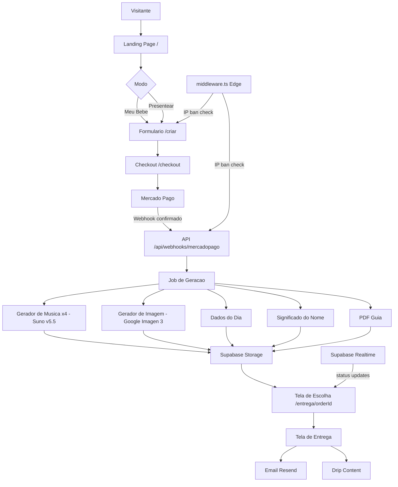
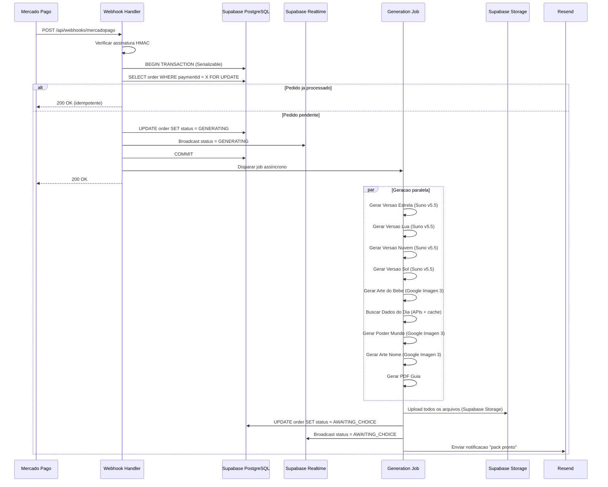

# Design Tecnico - NossoBebe Platform

## Overview

O NossoBebe e um micro-SaaS de pack comemorativo digital para recem-nascidos. O sistema recebe dados do bebe e preferencias dos pais, processa pagamento via Mercado Pago, gera em paralelo 4 cancoes de ninar completas (Suno v5.5 como principal / Google Lyria 3 Pro como fallback) + arte personalizada (Google Imagen 3) + poster de dados do dia + arte do significado do nome + PDF do guia, e entrega tudo via tela de download + email.

O fluxo central e: Landing Page -> Modo (Meu Bebe / Presentear) -> Formulario -> Checkout -> Geracao Paralela -> Tela de Escolha de Cancao -> Entrega. O sistema tambem inclui blog SEO programatico e drip content por email.

Stack: Next.js 16+ App Router (TypeScript strict), Supabase (PostgreSQL + Auth + Storage + Realtime), Prisma como ORM, Mercado Pago, Resend, PostHog, @upstash/ratelimit, Vercel.

### Provedores de IA

| Funcao | Provedor Principal | Fallback |
|--------|-------------------|---------|
| Geracao de musica | Suno v5.5 | Google Lyria 3 Pro |
| Geracao de imagem | Google Imagen 3 (Nano Banana 2) | - |

### Stack Completa

| Componente | Tecnologia |
|------------|-----------|
| Frontend | Next.js 16+ App Router + Tailwind CSS |
| Backend/API | Next.js API Routes (TypeScript strict) |
| Auth | Supabase Auth |
| Banco de dados | Supabase PostgreSQL + Prisma ORM |
| Storage | Supabase Storage (URLs assinadas) |
| Realtime | Supabase Realtime (status de geracao) |
| Geracao de musica | Suno v5.5 (principal) + Google Lyria 3 Pro (fallback) |
| Geracao de imagem | Google Imagen 3 |
| Pagamento | Mercado Pago |
| Email/Drip | Resend |
| Analytics | PostHog |
| Rate limiting | @upstash/ratelimit + Upstash Redis |
| Seguranca decoy | Upstash Redis (bannedIps set com TTL) |
| Hospedagem | Vercel |

## Architecture

### Visao Geral



### Camadas da Aplicacao

```
app/                          <- Next.js 16+ App Router
|-- (marketing)/              <- Landing page, blog (sem auth)
|   |-- page.tsx              <- Landing page
|   `-- blog/                 <- Blog SEO
|-- (purchase)/               <- Fluxo de compra
|   |-- criar/                <- Formulario wizard
|   |-- checkout/             <- Checkout
|   `-- entrega/[orderId]/    <- Tela de escolha + entrega
`-- api/
    |-- upload/               <- Upload de foto
    |-- orders/               <- CRUD de pedidos
    |-- generate/             <- Endpoints de geracao
    |-- webhooks/             <- Mercado Pago webhook
    |-- blog/                 <- API do blog
    |-- admin/                <- Endpoints decoy (armadilha)
    `-- v2/                   <- Endpoints decoy (armadilha)

lib/
|-- generators/
|   |-- music.ts              <- Suno v5.5 + Lyria fallback
|   |-- image.ts              <- Google Imagen 3
|   |-- day-data.ts           <- APIs externas + cache
|   `-- pdf.ts                <- Guia PLR
|-- storage/                  <- Supabase Storage
|-- payment/                  <- Mercado Pago
|-- email/                    <- Resend + templates
|-- validators/               <- Schemas Zod
|-- security/
|   |-- rate-limiter.ts       <- @upstash/ratelimit
|   |-- idor-guard.ts         <- Verificacao de propriedade
|   `-- decoy.ts              <- Honeypots e ban de IP
`-- analytics/                <- PostHog server-side

middleware.ts                 <- Edge: IP ban check (Upstash Redis)
```

### Supabase - Integracao Completa

**Auth**: Supabase Auth substitui NextAuth. Sessoes gerenciadas pelo Supabase via cookies httpOnly. O `createServerClient` do `@supabase/ssr` e usado em Server Components e API Routes para verificar sessao.

**Storage**: Supabase Storage substitui Cloudflare R2. Buckets: `baby-photos` (privado, TTL 24h), `pack-files` (privado, TTL 30 dias). URLs assinadas geradas via `supabase.storage.from(bucket).createSignedUrl(path, ttlSeconds)`.

**Realtime**: Supabase Realtime substitui polling manual. O cliente se inscreve no canal `order:{orderId}` e recebe atualizacoes de status em tempo real quando o job de geracao atualiza o banco. Elimina o polling a cada 3 segundos.

**PostgreSQL**: Supabase PostgreSQL com Prisma como ORM por cima. A connection string do Supabase e usada no `DATABASE_URL` do Prisma. Row Level Security (RLS) habilitado nas tabelas sensiveis como camada adicional de defesa.

### Fluxo de Geracao (pos-pagamento)



## Components and Interfaces

### API Routes

#### `POST /api/upload`
Recebe foto do bebe, valida (magic bytes + sharp), strip EXIF, renomeia com UUID, armazena no Supabase Storage.

```typescript
// Request: multipart/form-data
// Response: { fileKey: string }
// Rate limit: 5 req/min por IP
// Validacoes: tamanho <= 10MB, MIME real = jpeg/png/heic/heif, dimensoes < 8000px
// Storage: supabase.storage.from('baby-photos').upload(uuid, buffer)
```

#### `POST /api/orders`
Cria pedido com dados do formulario. Retorna orderId para redirecionar ao checkout.

```typescript
// Request: CreateOrderInput (ver Data Models)
// Response: { orderId: string }
// Validacao: Zod schema completo, honeypot check
// Auth: Supabase Auth session obrigatoria
```

#### `POST /api/checkout`
Inicia sessao de pagamento no Mercado Pago. Retorna URL de redirect ou dados do Pix.

```typescript
// Request: { orderId: string, items: CheckoutItem[] }
// Response: { pixCode?: string, pixQrCode?: string, redirectUrl?: string }
// Rate limit: 10 req/min por IP
// Validacao: valor total calculado no backend, nunca confiando no cliente
```

#### `POST /api/webhooks/mercadopago`
Recebe confirmacao de pagamento. Verifica assinatura, usa idempotency key, dispara geracao.

```typescript
// Idempotency: verifica order.paymentId antes de processar
// Transacao Prisma com isolationLevel: 'Serializable'
// Rate limit: 30 req/min por IP
// IP do Mercado Pago nunca e banido pelo sistema de honeypots
```

#### `POST /api/orders/[orderId]/choose`
Registra a cancao escolhida pelo comprador.

```typescript
// Request: { chosenVersion: 'estrela' | 'lua' | 'nuvem' | 'sol' }
// IDOR Guard: verifica que orderId pertence ao usuario da sessao Supabase
```

#### `POST /api/orders/[orderId]/regenerate`
Solicita regeneracao das 4 cancoes (limite: 1x por pedido).

```typescript
// Verifica order.regenerationCount < 1
// IDOR Guard obrigatorio
```

#### `GET /api/orders/[orderId]`
Retorna status e dados do pedido. Com Supabase Realtime, este endpoint e usado apenas para carga inicial.

```typescript
// IDOR Guard: verifica propriedade via Supabase Auth session
// Response: { status, products, chosenVersion, signedUrls }
// signedUrls: URLs assinadas frescas do Supabase Storage (TTL 30 dias)
```

#### `POST /api/orders/[orderId]/upsell`
Processa upsell de musicas extras ou outros produtos.

```typescript
// Valida valor no backend (R$9,90 ou R$19,90 para musicas)
// Inicia novo pagamento MP para o upsell
```

### Endpoints Decoy (ver secao Security)

```
GET /api/admin/users    <- Retorna usuarios ficticios, bane IP
GET /api/v2/export      <- Retorna dados ficticios, bane IP
GET /wp-admin/          <- HTML fake de login WordPress, bane IP
GET /phpmyadmin/        <- HTML fake, bane IP
GET /.env               <- Conteudo fake de .env, bane IP
```

### Componentes Frontend Principais

#### `ModeSelector` (`/criar`)
Dois cards grandes: "Meu bebe" e "Presentear um bebe". Persiste escolha no estado da sessao.

#### `PurchaseWizard` (`/criar`)
Wizard de 3 steps com estado gerenciado por React Context:
- Step 1: Upload de foto (com preview + crop) + campo honeypot oculto via CSS
- Step 2: Dados do bebe (+ campos extras no modo Presentear)
- Step 3: Preferencias musicais e de arte

#### `MusicPlayer` (`/entrega/[orderId]`)
Player individual por versao com:
- Waveform visual (WaveSurfer.js ou similar)
- Letra completa abaixo do player
- Botao "Quero essa!" com estado de loading
- Botao "Ouvir novamente"

#### `GenerationProgress` (`/entrega/[orderId]`)
Progress bar animada durante geracao. Usa **Supabase Realtime** para receber atualizacoes de status em tempo real (sem polling manual).

```typescript
// Supabase Realtime subscription
const channel = supabase
  .channel(`order:${orderId}`)
  .on('postgres_changes', {
    event: 'UPDATE',
    schema: 'public',
    table: 'Order',
    filter: `id=eq.${orderId}`,
  }, (payload) => {
    setStatus(payload.new.status);
  })
  .subscribe();
```

#### `DeliveryGallery` (`/entrega/[orderId]`)
Galeria com player de audio da cancao escolhida, previews das imagens e botao de download ZIP.

### Servicos Externos

#### `MusicGenerator` (`lib/generators/music.ts`)

```typescript
interface MusicGeneratorOptions {
  babyName: string;
  musicStyle: MusicStyle;
  musicTone: 'alegre' | 'suave';
  specialWords?: string;
  nameMeaning?: string;
  version: 'estrela' | 'lua' | 'nuvem' | 'sol';
}

async function generateMusic(opts: MusicGeneratorOptions): Promise<Buffer>
// Tenta Suno v5.5 (principal) -> fallback Google Lyria 3 Pro
// Retry: 3 tentativas por provedor
// Timeout: 45s por tentativa
// IMPORTANTE: consultar documentacao atualizada via context7 antes de implementar
// A API do Suno evolui rapidamente - verificar endpoints e parametros atuais
```

#### `ImageGenerator` (`lib/generators/image.ts`)

```typescript
// Provedor: Google Imagen 3 (internamente "Nano Banana 2")
// IMPORTANTE: consultar documentacao atualizada via context7 antes de implementar
// Google Imagen 3 tem atualizacoes frequentes de API e parametros

async function generateBabyArt(photoBuffer: Buffer, artStyle: ArtStyle): Promise<Buffer>
// Resolucao: 3000x3000px, formato PNG

async function generateWorldPoster(dayData: DayData, babyName: string, birthDate: Date): Promise<Buffer>
// Resolucao: 3000x4000px, formato PNG

async function generateNameArt(babyName: string, meaning: string, poeticText: string): Promise<Buffer>
// Resolucao: 3000x3000px, formato PNG
```

#### `DayDataFetcher` (`lib/generators/day-data.ts`)

```typescript
interface DayData {
  topSong: string;
  topMovie: string;
  moonPhase: string;
  weather: string;
  funFact: string;
}

async function fetchDayData(date: Date, city: string): Promise<DayData>
// Cache Upstash Redis por `${date.toISOString().slice(0,10)}_${city}`
// TTL: 24h
// Fallback por campo se API indisponivel
```

#### `StorageService` (`lib/storage/index.ts`)

```typescript
// Usa Supabase Storage em vez de Cloudflare R2
// Buckets: 'baby-photos' (privado) e 'pack-files' (privado)

async function uploadFile(bucket: string, key: string, buffer: Buffer, contentType: string): Promise<string>
// supabase.storage.from(bucket).upload(key, buffer, { contentType })

async function getSignedUrl(bucket: string, key: string, ttlSeconds: number): Promise<string>
// supabase.storage.from(bucket).createSignedUrl(key, ttlSeconds)

async function deleteFile(bucket: string, key: string): Promise<void>
// supabase.storage.from(bucket).remove([key])
```

#### `AuthService` (`lib/auth/index.ts`)

```typescript
// Usa Supabase Auth em vez de NextAuth
// Server Components: createServerClient do @supabase/ssr
// API Routes: createServerClient com cookies do request

async function getSession(request: Request): Promise<Session | null>
// Retorna sessao Supabase ou null

async function requireSession(request: Request): Promise<Session>
// Lanca erro 401 se nao autenticado
```

## Data Models

### Prisma Schema

O schema Prisma conecta ao Supabase PostgreSQL via `DATABASE_URL`. Row Level Security (RLS) e habilitado no Supabase como camada adicional de defesa alem do IDOR Guard da aplicacao.

```prisma
// schema.prisma
// DATABASE_URL aponta para Supabase PostgreSQL (connection pooling via pgBouncer)

enum OrderMode {
  SELF
  GIFT
}

enum OrderStatus {
  PENDING_PAYMENT
  GENERATING
  AWAITING_CHOICE
  COMPLETED
  FAILED
  REFUNDED
}

enum ProductType {
  MUSIC_ESTRELA
  MUSIC_LUA
  MUSIC_NUVEM
  MUSIC_SOL
  ART_BABY
  POSTER_WORLD
  ART_NAME
  GUIDE_PDF
  ZIP_PACK
}

enum ProductStatus {
  PENDING
  GENERATING
  DONE
  FAILED
}

model Order {
  id                  String      @id @default(cuid())
  mode                OrderMode
  status              OrderStatus @default(PENDING_PAYMENT)

  // Dados do bebe
  babyName            String      @db.VarChar(50)
  birthDate           DateTime    @db.Date
  birthTime           String?     @db.VarChar(5)   // HH:MM
  birthWeight         String?     @db.VarChar(10)
  birthCity           String      @db.VarChar(100)
  parentNames         String?     @db.VarChar(100)

  // Preferencias
  musicStyle          String      @db.VarChar(20)
  musicTone           String      @db.VarChar(10)
  specialWords        String?     @db.VarChar(200)
  artStyle            String      @db.VarChar(20)

  // Foto - armazenada no Supabase Storage bucket 'baby-photos'
  photoKey            String?     // Chave no Supabase Storage (UUID)
  hasPhoto            Boolean     @default(true)
  photoDeletedAt      DateTime?

  // Comprador
  buyerEmail          String      @db.VarChar(254)
  buyerName           String?     @db.VarChar(100)
  supabaseUserId      String?     // ID do usuario no Supabase Auth

  // Destinatario (modo GIFT)
  recipientEmail      String?     @db.VarChar(254)
  giftMessage         String?     @db.VarChar(300)
  scheduledDeliveryAt DateTime?
  voucherCode         String?     @unique
  voucherRedeemedAt   DateTime?

  // Pagamento
  paymentId           String?     @unique  // ID do Mercado Pago (idempotency key)
  paymentMethod       String?     @db.VarChar(20)
  amount              Decimal     @db.Decimal(10, 2)

  // Escolha da cancao
  chosenVersion       String?     @db.VarChar(10)  // estrela|lua|nuvem|sol
  regenerationCount   Int         @default(0)

  // Upsells adquiridos
  upsellMusicExtra    Boolean     @default(false)
  upsellMusicPack     Boolean     @default(false)
  extraMusicVersion   String?     @db.VarChar(10)

  // Drip content
  dripConsentAt       DateTime?
  dripOptOutAt        DateTime?

  // Timestamps
  createdAt           DateTime    @default(now())
  updatedAt           DateTime    @updatedAt
  deliveredAt         DateTime?

  products            Product[]
  dripEmails          DripEmail[]
}

model Product {
  id          String        @id @default(cuid())
  orderId     String
  order       Order         @relation(fields: [orderId], references: [id])
  type        ProductType
  status      ProductStatus @default(PENDING)
  // fileKey: chave no Supabase Storage bucket 'pack-files'
  fileKey     String?
  metadata    Json?         // Dados especificos (letra da musica, etc.)
  errorMsg    String?
  createdAt   DateTime      @default(now())
  updatedAt   DateTime      @updatedAt

  @@index([orderId])
}

model DripEmail {
  id          String    @id @default(cuid())
  orderId     String
  order       Order     @relation(fields: [orderId], references: [id])
  weekNumber  Int       // 0, 1, 2, 3, 4, 8, 12, ...
  scheduledAt DateTime
  sentAt      DateTime?
  status      String    @db.VarChar(20)  // SCHEDULED | SENT | FAILED | SKIPPED
  templateId  String    @db.VarChar(50)

  @@index([orderId])
  @@index([scheduledAt, status])
}

model NameEntry {
  id           String  @id @default(cuid())
  name         String  @unique @db.VarChar(100)
  origin       String  @db.VarChar(200)
  meaning      String  @db.Text
  personality  String  @db.Text
  popularity   String? @db.VarChar(100)
  famousPeople String? @db.Text
  combinations String? @db.Text
  blogSlug     String? @db.VarChar(200)
}

model BlogPost {
  id            String   @id @default(cuid())
  slug          String   @unique @db.VarChar(200)
  title         String   @db.VarChar(200)
  description   String   @db.VarChar(300)
  category      String   @db.VarChar(50)
  content       String   @db.Text
  schemaType    String   @db.VarChar(20)  // ARTICLE | FAQ | HOWTO
  publishedAt   DateTime
  updatedAt     DateTime @updatedAt
  hasDisclaimer Boolean  @default(false)
}

model DayDataCache {
  id        String   @id @default(cuid())
  cacheKey  String   @unique  // "YYYY-MM-DD_cidade"
  data      Json
  expiresAt DateTime

  @@index([expiresAt])
}
```

### Tipos TypeScript Principais

```typescript
// lib/types.ts

type MusicStyle = 'mpb' | 'instrumental' | 'gospel' | 'classico' | 'lofi' | 'pop';
type ArtStyle = 'aquarela' | 'ilustracao' | 'minimalista' | 'retro';
type MusicVersion = 'estrela' | 'lua' | 'nuvem' | 'sol';

interface CreateOrderInput {
  mode: 'SELF' | 'GIFT';
  babyName: string;
  birthDate: string;        // ISO date
  birthTime?: string;       // HH:MM
  birthWeight?: string;
  birthCity: string;
  parentNames?: string;
  musicStyle: MusicStyle;
  musicTone: 'alegre' | 'suave';
  specialWords?: string;
  artStyle: ArtStyle;
  buyerEmail: string;
  buyerName?: string;
  // Campos GIFT
  recipientEmail?: string;
  giftMessage?: string;
  scheduledDeliveryAt?: string;
  hasPhoto?: boolean;
  // Honeypot
  website?: string;
}

interface GenerationJobPayload {
  orderId: string;
  isRegeneration: boolean;
}
```

## Correctness Properties

*A property is a characteristic or behavior that should hold true across all valid executions of a system - essentially, a formal statement about what the system should do. Properties serve as the bridge between human-readable specifications and machine-verifiable correctness guarantees.*

### Property 1: Idempotencia do webhook de pagamento

*Para qualquer* webhook de pagamento do Mercado Pago com o mesmo `paymentId`, processar o webhook N vezes (N >= 1) deve resultar no mesmo estado final do pedido que processar 1 vez - o pedido nunca deve ser gerado mais de uma vez e `Order.status` deve ser identico independente de quantas vezes o webhook for recebido.

**Validates: Requirements 5.5, 5.6, 11.1, 11.2**

### Property 2: Validacao de input rejeita valores fora do dominio

*Para qualquer* objeto de criacao de pedido onde `musicStyle` ou `artStyle` contem um valor que nao pertence ao conjunto de valores validos do enum, o sistema deve retornar HTTP 400 e o banco de dados nao deve conter nenhum novo registro de pedido apos a requisicao.

**Validates: Requirements 4.5, 4.6, 3.5, 3.6**

### Property 3: Validacao de upload rejeita arquivos invalidos

*Para qualquer* buffer de arquivo cujos magic bytes nao correspondam a JPEG, PNG, HEIC ou HEIF, ou cujo tamanho exceda 10MB, ou cujas dimensoes excedam 8000px em qualquer eixo, o sistema deve retornar HTTP 400 e nunca armazenar o arquivo no Storage.

**Validates: Requirements 2.1, 2.2, 2.3, 2.4**

### Property 4: IDOR - pedido pertence ao usuario

*Para qualquer* par (`orderId`, `userEmail`) onde `userEmail` nao e o email do comprador do pedido, qualquer endpoint que receba esse `orderId` deve retornar HTTP 404 sem revelar a existencia do recurso nem retornar dados do pedido.

**Validates: Requirements 8.2, 8.3, 10.4**

### Property 5: Honeypot rejeita bots silenciosamente

*Para qualquer* string nao-vazia enviada no campo honeypot (`website`), o sistema deve retornar HTTP 200 com resposta fake sem criar nenhum registro de pedido no banco de dados.

**Validates: Requirements 3.7**

### Property 6: Regeneracao limitada a 1 vez por pedido

*Para qualquer* pedido com `regenerationCount >= 1`, qualquer chamada ao endpoint de regeneracao deve ser rejeitada com mensagem de limite atingido - `regenerationCount` nunca deve ultrapassar 1.

**Validates: Requirements 6.6, 6.7**

### Property 7: Voucher de uso unico

*Para qualquer* voucher com `voucherRedeemedAt` ja preenchido, qualquer tentativa subsequente de resgate deve retornar erro sem alterar o estado do voucher nem iniciar nova geracao de arte.

**Validates: Requirements 12.3, 12.5**

### Property 8: Valor do pedido calculado no backend

*Para qualquer* payload de checkout ou upsell enviado pelo cliente com valores monetarios arbitrarios, o valor efetivamente cobrado ao Mercado Pago deve corresponder exclusivamente a tabela de precos definida no servidor - nunca ao valor enviado pelo cliente.

**Validates: Requirements 6A.6, 15.6**

### Property 9: Rate limiting retorna 429 com Retry-After

*Para qualquer* endpoint com rate limit configurado e qualquer IP, quando o numero de requisicoes excede o limite da janela de tempo, todas as requisicoes excedentes devem retornar HTTP 429 com o header `Retry-After` presente e com valor maior que zero.

**Validates: Requirements 10.2, 10.3**

### Property 10: Sanitizacao de input antes de prompts de IA

*Para qualquer* string de texto livre enviada pelo usuario (campo `specialWords`, `giftMessage`, `babyName`), apos sanitizacao, o prompt enviado ao gerador de musica ou imagem nao deve conter padroes de prompt injection - qualquer instrucao de sistema, delimitador de prompt ou comando de override deve ser removido ou escapado.

**Validates: Requirements 10.5**

## Error Handling

### Estrategia Geral

- Erros para o cliente: mensagens genericas em PT-BR, sem stack traces ou detalhes internos
- Erros para logs: detalhados com contexto (orderId, userId, endpoint, payload sanitizado)
- Nunca logar dados pessoais (email, nome, foto)

### Falhas na Geracao de Musica

```
Suno v5.5 falha -> retry 3x com backoff (1s, 2s, 4s)
Suno v5.5 falha 3x -> fallback Google Lyria 3 Pro
Lyria falha -> retry 3x com backoff
Lyria falha 3x -> marcar Product.status = FAILED
Todas as 4 cancoes falharem -> Order.status = FAILED + email ao comprador
1-3 cancoes falharem -> tentar regenerar as falhadas (ate 2x extras)
```

### Falhas na Geracao de Imagem (Google Imagen 3)

```
Imagen 3 falha -> retry 3x com backoff (2s, 4s, 8s)
Imagen 3 falha 3x -> marcar Product.status = FAILED
Arte do bebe falha -> notificar comprador, entrega parcial do pack
Poster/Nome falha -> usar fallback de template estatico
```

### Falhas nas APIs de Dados do Dia

Cada campo tem fallback independente:
- Spotify Charts indisponivel -> "Musica nao disponivel para esta data"
- OpenWeather indisponivel -> "Clima nao disponivel"
- TMDB indisponivel -> "Filmes nao disponiveis"
- Lunar API indisponivel -> calcular fase lunar localmente (algoritmo simples)

O poster e gerado mesmo com dados parciais - campos indisponiveis sao omitidos visualmente.

### Falhas de Pagamento

- Webhook com assinatura invalida -> HTTP 401, log de alerta
- Webhook duplicado -> HTTP 200 sem reprocessar (idempotencia)
- Timeout no Mercado Pago -> pedido permanece em `PENDING_PAYMENT`, usuario pode tentar novamente

### Falhas de Upload

- Arquivo > 10MB -> HTTP 400 "Arquivo muito grande. Maximo: 10MB"
- MIME invalido -> HTTP 400 "Formato nao suportado. Use JPG, PNG ou HEIC"
- Dimensoes invalidas -> HTTP 400 "Imagem invalida ou corrompida"
- Erro no Supabase Storage -> HTTP 500 generico + log detalhado

### Expiracao de URLs Assinadas

URLs do Supabase Storage tem TTL de 30 dias para pack-files e 24h para baby-photos. Quando o usuario acessa a tela de entrega e as URLs expiraram, o sistema renova automaticamente via `GET /api/orders/[orderId]` que gera novas URLs assinadas via `supabase.storage.from(bucket).createSignedUrl(key, ttlSeconds)`.

### Falhas de Autenticacao (Supabase Auth)

- Sessao expirada -> redirecionar para login, preservar URL de destino
- Token invalido -> HTTP 401 generico
- Supabase Auth indisponivel -> HTTP 503 com mensagem amigavel

## Testing Strategy

### Abordagem Dual

O projeto usa testes de exemplo (Vitest) para comportamentos especificos e testes baseados em propriedades (fast-check) para invariantes universais.

### Testes de Propriedade (fast-check)

Biblioteca: **fast-check** (TypeScript nativo, sem dependencias extras).
Configuracao: minimo 100 iteracoes por propriedade (`{ numRuns: 100 }`).
Tag de referencia em cada teste: `// Feature: nossobebe-platform, Property N: <texto>`

**Property 1 - Idempotencia do webhook:**
Gerar N copias do mesmo payload de webhook e processar todas. Verificar que `Order.status` e `Order.paymentId` sao identicos apos qualquer numero de processamentos.

**Property 2 - Validacao de input (enum):**
Gerar strings aleatorias para `musicStyle` e `artStyle`. Verificar que apenas os valores do enum sao aceitos e qualquer outro retorna 400 sem persistir dados.

**Property 3 - Validacao de upload:**
Gerar buffers com magic bytes aleatorios e tamanhos variados. Verificar que apenas arquivos com magic bytes validos e tamanho <= 10MB sao aceitos.

**Property 4 - IDOR:**
Gerar pares aleatorios de (orderId, userEmail) onde o email nao e o dono do pedido. Verificar que a resposta e sempre 404.

**Property 5 - Honeypot:**
Gerar strings aleatorias nao-vazias para o campo `website`. Verificar que nenhuma cria um pedido real no banco.

**Property 6 - Regeneracao limitada:**
Para qualquer pedido com `regenerationCount >= 1`, verificar que a API de regeneracao retorna erro sem incrementar o contador.

**Property 7 - Voucher de uso unico:**
Para qualquer voucher ja com `voucherRedeemedAt` preenchido, verificar que qualquer tentativa de resgate retorna erro sem alterar o estado.

**Property 8 - Valor calculado no backend:**
Gerar combinacoes aleatorias de itens com valores manipulados no payload. Verificar que o valor cobrado ao Mercado Pago sempre corresponde a tabela de precos do servidor.

**Property 9 - Rate limiting:**
Para qualquer endpoint com limite configurado, enviar N+1 requisicoes onde N e o limite. Verificar que a N+1-esima retorna 429 com `Retry-After`.

**Property 10 - Sanitizacao de prompts:**
Gerar strings com padroes de prompt injection (instrucoes de sistema, delimitadores, overrides). Verificar que o prompt final enviado ao gerador nao contem os padroes maliciosos.

### Testes de Exemplo (Vitest)

- Validacao Zod: casos especificos de campos obrigatorios, formatos de data, enums
- Geracao de musica: mock do Suno + verificar que fallback Lyria e acionado na falha
- Cache de dados do dia: verificar que a segunda chamada com mesma chave nao chama a API externa
- Drip content: verificar sequencia de datas de envio para um pedido criado em data X
- Modo Presentear: verificar que email vai para `recipientEmail`, nao `buyerEmail`
- Honeypot: verificar que campo `website` preenchido retorna 200 fake sem criar pedido
- Voucher: verificar geracao de UUID v4, TTL de 90 dias, limite de 5 por email/dia
- Supabase Auth: verificar que sessao invalida retorna 401 em endpoints protegidos
- Supabase Storage: verificar que URLs assinadas sao geradas com TTL correto
- Decoy endpoints: verificar que acesso bane o IP no Upstash Redis com TTL correto

### Testes de Integracao

- Fluxo completo de pagamento com Mercado Pago sandbox
- Upload -> validacao -> strip EXIF -> armazenamento no Supabase Storage (staging)
- Envio de email via Resend (staging com email de teste)
- Geracao de musica com Suno v5.5 (1 chamada real em CI, restante mockado)
- Supabase Realtime: verificar que atualizacao de status e recebida pelo cliente

### Testes de Seguranca

- IDOR: tentar acessar pedido de outro usuario -> 404
- Rate limit: verificar headers 429 + Retry-After
- Webhook com assinatura invalida -> 401
- Upload com magic bytes falsificados -> 400
- Prompt injection em `specialWords` -> verificar sanitizacao antes do prompt
- Decoy endpoints: verificar ban de IP apos acesso
- IP banido: verificar que todas as requisicoes subsequentes retornam 403

### Cobertura Alvo

| Camada | Meta |
|--------|------|
| Validators (Zod schemas) | 100% |
| Logica de negocio (generators, payment) | >80% |
| API Routes | >70% (com mocks) |
| Componentes React | Snapshot + interacao critica |
| Security (decoy, ban, honeypot) | >90% |

## Security - Honeypots e Defesa em Profundidade

Esta secao detalha o sistema completo de honeypots, endpoints decoy e ban automatico de IPs conforme as diretrizes de `docs/SECURITY copy.md`.

### Endpoints Decoy (Armadilhas para Scanners)

Os endpoints abaixo sao armadilhas. Nenhum usuario legitimo jamais os acessa. Qualquer acesso indica scanner automatizado, bot ou atacante.

| Endpoint | Resposta Fake | Comportamento |
|----------|--------------|---------------|
| `GET /api/admin/users` | JSON com usuarios ficticios (nomes/emails fake) | Ban IP 24h |
| `GET /api/v2/export` | JSON com dados de exportacao ficticios | Ban IP 24h |
| `GET /wp-admin/` | HTML fake de login WordPress | Ban IP 24h |
| `GET /phpmyadmin/` | HTML fake de login phpMyAdmin | Ban IP 24h |
| `GET /.env` | Conteudo fake de arquivo .env | Ban IP 24h |

**Regra critica**: Todos retornam HTTP 200 com conteudo plausivel mas ficticio. Nunca 404 - isso alertaria o atacante de que a armadilha foi detectada.

### Comportamento ao Detectar Acesso a Endpoint Decoy

Quando qualquer endpoint decoy e acessado, o sistema executa em paralelo:

1. Retornar resposta fake (200 com conteudo plausivel mas ficticio)
2. Registrar o IP no log com timestamp e endpoint acessado
3. Banir o IP automaticamente por 24h via Upstash Redis (bannedIps set com TTL)
4. Disparar alerta (log de nivel ERROR + notificacao via Sentry se configurado)

Qualquer requisicao subsequente do IP banido retorna 403 em TODOS os endpoints.

```typescript
// lib/security/decoy.ts

export async function handleDecoyAccess(ip: string, endpoint: string): Promise<void> {
  await Promise.all([
    banIp(ip, 24 * 60 * 60), // 24h em segundos
    logSecurityEvent({ type: 'DECOY_ACCESS', ip, endpoint, timestamp: new Date() }),
    alertIfConfigured({ type: 'DECOY_ACCESS', ip, endpoint }),
  ]);
}

export async function banIp(ip: string, ttlSeconds: number): Promise<void> {
  const redis = getUpstashRedis();
  await redis.set(`bannedIp:${ip}`, '1', { ex: ttlSeconds });
}

export async function checkBannedIp(ip: string): Promise<boolean> {
  const redis = getUpstashRedis();
  const result = await redis.get(`bannedIp:${ip}`);
  return result !== null;
}

function logSecurityEvent(event: SecurityEvent): void {
  console.error('[SECURITY]', JSON.stringify(event));
  // Sentry.captureMessage se configurado
}
```

### Middleware de Verificacao de IP Banido

O middleware roda em Edge Runtime e verifica o Upstash Redis antes de qualquer request chegar aos handlers.

```typescript
// middleware.ts
import { NextRequest, NextResponse } from 'next/server';
import { checkBannedIp } from '@/lib/security/decoy';

// IPs do Mercado Pago nunca sao banidos (webhooks de pagamento)
const MERCADOPAGO_IPS = ['190.220.0.0/16']; // verificar IPs atuais na doc do MP

export async function middleware(request: NextRequest) {
  const ip = request.headers.get('x-forwarded-for')?.split(',')[0]?.trim() ?? 'unknown';

  // Nunca banir IPs do Mercado Pago (webhooks de pagamento)
  const isMercadoPagoWebhook = request.nextUrl.pathname.startsWith('/api/webhooks/mercadopago');
  if (!isMercadoPagoWebhook) {
    const isBanned = await checkBannedIp(ip);
    if (isBanned) {
      return new NextResponse('Forbidden', { status: 403 });
    }
  }

  return NextResponse.next();
}

export const config = {
  matcher: ['/api/:path*', '/criar/:path*', '/checkout/:path*', '/entrega/:path*'],
};
```

### Honeypot de Formulario

O formulario de criacao de pedido inclui um campo honeypot oculto via CSS. Bots que preenchem todos os campos visiveis tendem a preencher este campo tambem.

```tsx
// Componente PurchaseWizard - campo honeypot
<input
  type="text"
  name="website"
  style={{ position: 'absolute', left: '-9999px', top: '-9999px' }}
  tabIndex={-1}
  autoComplete="off"
  aria-hidden="true"
/>
```

Comportamento no backend quando `website` e preenchido:
1. Retornar HTTP 200 com resposta fake `{ success: true }` (nao alertar o bot)
2. Registrar IP no log
3. Banir IP por 1h via Upstash Redis

```typescript
// Em POST /api/orders
if (body.website && body.website.trim() !== '') {
  const ip = getClientIp(request);
  await Promise.all([
    banIp(ip, 60 * 60), // 1h
    logSecurityEvent({ type: 'HONEYPOT_TRIGGERED', ip, endpoint: '/api/orders' }),
  ]);
  return NextResponse.json({ success: true }); // Resposta fake
}
```

### Headers de Seguranca HTTP

Configurados em `next.config.js` para todas as respostas:

```javascript
const securityHeaders = [
  { key: 'X-DNS-Prefetch-Control', value: 'on' },
  { key: 'Strict-Transport-Security', value: 'max-age=63072000; includeSubDomains; preload' },
  { key: 'X-Frame-Options', value: 'SAMEORIGIN' },
  { key: 'X-Content-Type-Options', value: 'nosniff' },
  { key: 'Referrer-Policy', value: 'origin-when-cross-origin' },
  { key: 'Permissions-Policy', value: 'camera=(), microphone=(), geolocation=()' },
  {
    key: 'Content-Security-Policy',
    value: [
      "default-src 'self'",
      "script-src 'self' 'unsafe-inline' 'unsafe-eval' https://pagead2.googlesyndication.com https://www.googletagmanager.com",
      "style-src 'self' 'unsafe-inline'",
      // Supabase Storage em vez de R2
      "img-src 'self' data: https://*.supabase.co https://pagead2.googlesyndication.com",
      "media-src 'self' https://*.supabase.co",
      "connect-src 'self' https://*.supabase.co https://api.mercadopago.com https://pagead2.googlesyndication.com",
      "frame-src https://pagead2.googlesyndication.com",
    ].join('; ')
  },
];
```

### Rate Limiting

Aplicado em todos os endpoints publicos via `@upstash/ratelimit`:

| Endpoint | Limite | Janela |
|----------|--------|--------|
| `POST /api/upload` | 5 requests | 1 minuto |
| `POST /api/generate/*` | 3 requests | 1 minuto |
| `POST /api/checkout` | 10 requests | 1 minuto |
| `GET /api/blog/*` | 60 requests | 1 minuto |
| `POST /api/webhooks/*` | 30 requests | 1 minuto |

## Implementation Guidelines

Esta secao contem regras obrigatorias para qualquer desenvolvedor ou agente que for implementar as tasks deste projeto. Nao sao sugestoes - sao pre-requisitos para comecar qualquer implementacao.

### Antes de Implementar Qualquer Task

**1. Ler e seguir TODAS as diretrizes de `docs/SECURITY copy.md`**

O arquivo `docs/SECURITY copy.md` contem o checklist de seguranca completo. Nenhuma feature pode ser marcada como pronta sem passar por esse checklist. As regras incluem:
- Validacao Zod em todos os endpoints
- IDOR Guard em todo endpoint que recebe ID
- Rate limiting aplicado
- Sem dados sensiveis no response
- Sem console.log com dados do usuario
- Transacao com lock para operacoes criticas
- Upload validado por magic bytes
- URLs de recursos validadas contra allowlist
- Headers de seguranca presentes

**2. Consultar documentacao atualizada via context7 antes de usar qualquer biblioteca**

As seguintes bibliotecas DEVEM ter sua documentacao consultada via context7 antes de qualquer implementacao:

| Biblioteca | Motivo |
|-----------|--------|
| Next.js 16+ | Pode ter breaking changes em relacao a versoes anteriores. App Router, middleware e Server Actions evoluem rapidamente |
| Supabase (Auth, Storage, Realtime) | SDK tem atualizacoes frequentes. Metodos de autenticacao, RLS e Realtime mudam entre versoes |
| Suno v5.5 API | API de IA evolui rapidamente - endpoints, parametros e limites podem ter mudado |
| Google Imagen 3 | API nova, documentacao pode ter mudado desde o treinamento do modelo |
| Mercado Pago SDK | Integracao de pagamento - qualquer erro pode causar perda financeira |
| Resend | API de email - verificar parametros atuais de envio e templates |
| @upstash/ratelimit | Verificar API atual para sliding window e fixed window |
| Prisma | Verificar compatibilidade com Supabase PostgreSQL e versao atual |

**Por que context7 e obrigatorio:**
- Usar documentacao desatualizada pode gerar codigo que nao funciona
- APIs de IA (Suno, Google Imagen 3) evoluem rapidamente - a documentacao pode ter mudado
- Supabase tem atualizacoes frequentes de SDK
- Next.js 16+ pode ter breaking changes em relacao a versoes anteriores
- Codigo com vulnerabilidades pode surgir de APIs mal compreendidas

**3. Verificar o checklist de seguranca antes de marcar qualquer feature como pronta**

```
Checklist obrigatorio (de docs/SECURITY copy.md):
[ ] Inputs validados com zod (tipos, tamanhos, formatos)
[ ] IDOR verificado (recurso pertence ao usuario?)
[ ] Rate limiting aplicado
[ ] Sem dados sensiveis no response que nao deveriam estar la
[ ] Sem console.log com dados do usuario
[ ] Erro generico para o client, erro detalhado nos logs
[ ] Transacao com lock para operacoes de escrita criticas
[ ] Upload validado por magic bytes (se aplicavel)
[ ] URLs de recursos validadas contra allowlist
[ ] Headers de seguranca presentes
```

### Regras Especificas por Componente

**Supabase Auth:**
- Usar `createServerClient` do `@supabase/ssr` em Server Components e API Routes
- Nunca usar o client do lado do cliente para operacoes sensiveis
- Sempre verificar sessao antes de retornar dados de pedidos

**Supabase Storage:**
- Nunca expor URLs publicas permanentes - sempre usar URLs assinadas com TTL
- bucket `baby-photos`: TTL de 24h (foto deletada apos geracao da arte)
- bucket `pack-files`: TTL de 30 dias (links de download)
- Deletar foto original em ate 24h apos geracao bem-sucedida da arte

**Suno v5.5 (provedor principal de musica):**
- Consultar context7 para endpoints e parametros atuais
- Implementar retry com backoff antes de acionar fallback Lyria
- Sanitizar `babyName`, `specialWords` antes de interpolar no prompt

**Google Imagen 3 (provedor de imagem):**
- Consultar context7 para API atual (pode ser via Vertex AI ou Google AI Studio)
- Verificar parametros de resolucao e formato suportados na versao atual
- Sanitizar todos os inputs antes de interpolar nos prompts

**Honeypots e Decoy:**
- Implementar `middleware.ts` ANTES de qualquer outro endpoint
- Testar que IPs do Mercado Pago nao sao banidos
- Verificar que endpoints decoy retornam 200 (nunca 404)

**Supabase Realtime:**
- Usar para substituir polling manual na `GenerationProgress`
- Inscrever no canal `order:{orderId}` com filtro por ID
- Cancelar subscription quando componente for desmontado (cleanup)